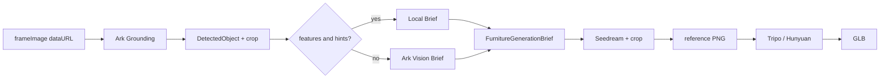

# 识图 → 生图 → 生 3D：数据传输协议与完整 Prompt

面向复现 / 优化本链路的同学。内容与当前代码一致（`feature_tripo` / `feature_hunyuan`）。

| 项 | 值 |
|---|---|
| 代码入口 | `backend/app/routers/feed.py` → `select-object` |
| 检测 | `DETECTION_PROVIDER=ark_grounding` |
| 3D | `MODEL3D_PROVIDER=feature_tripo`（默认）或 `feature_hunyuan` |
| 视觉模型 | `ARK_VISION_MODEL=doubao-seed-2-1-pro-260628` |
| 生图模型 | `ARK_IMAGE_MODEL=doubao-seedream-5-0-lite-260128` |
| Ark Base | `https://ark.cn-beijing.volces.com/api/v3` |

---

## 0. 总览

```text
[原图 / 暂停帧]
    │
    ▼ ① 识图（Ark Vision chat/completions）
DetectedObject[]  + crop/mask
    │  visualFeatures / generationHints
    ▼ ② 特征 Brief（可跳过二次视觉）
FurnitureGenerationBrief.json
    │
    ▼ ③ 生图（Ark Seedream images/generations）
reference_oblique_3quarter.png   ← 45° 产品参考图
    │
    ▼ ④ 生 3D（Tripo 或 Hunyuan，吃参考图）
model.glb
```

**原则**

1. 检测阶段尽量一次写齐 `features` + `generationHints`，后续 brief 可本地拼装，省一次视觉调用。  
2. Seedream 负责「规整化 + 隔离主体」；3D 模型主要吃 **参考图**，不是原场景图。  
3. 世界坐标位姿不在本链路；布局用扫描 OBB / `scene.json`。

---

## 1. 业务 API 数据传输（Rombot Backend）

### 1.1 检测 `POST /api/feed/detect`

**Request**

```json
{
  "videoId": "living_room_001",
  "time": 12.4,
  "frameImage": "data:image/jpeg;base64,..."
}
```

**Response（核心字段）**

```json
{
  "frameId": "frame_living_room_001_12_40",
  "frameImageUrl": "/outputs/frame_.../frame.jpg",
  "objects": [
    {
      "id": "obj_sofa_001",
      "label": "sofa",
      "name": "沙发",
      "confidence": 0.95,
      "bbox": [x1, y1, x2, y2],
      "tagPosition": [0.42, 0.55],
      "cropUrl": "/outputs/frame_.../obj_sofa_001_crop.jpg",
      "maskUrl": "/outputs/frame_.../obj_sofa_001_mask.png",
      "visualFeatures": { },
      "generationHints": { }
    }
  ]
}
```

| 字段 | 含义 |
|---|---|
| `bbox` | 像素坐标 `[left, top, right, bottom]`（Ark 原始为 0–999，后端按图宽高缩放） |
| `visualFeatures` | 可见证据（几何/材质/颜色/纹理） |
| `generationHints` | 规整、对称、遮挡补全、复杂度降低等生成侧提示 |
| `cropUrl` / `maskUrl` | bbox crop；默认 `SEGMENTATION_PROVIDER=mock` 时 mask 为矩形 |

### 1.2 选物生 3D `POST /api/feed/select-object`

**Request**

```json
{
  "frameId": "frame_...",
  "objectId": "obj_sofa_001",
  "frameImage": "data:image/jpeg;base64,...",
  "imageUrl": null,
  "cropImage": null
}
```

图像优先级：`imageUrl` → `cropImage` → 分割/检测 crop。

**Response（核心字段）**

```json
{
  "taskId": "...",
  "status": "SUCCEEDED",
  "object": {
    "id": "obj_sofa_001",
    "label": "sofa",
    "name": "沙发",
    "bbox": [x1, y1, x2, y2],
    "cropUrl": "...",
    "maskUrl": "...",
    "glbUrl": "/outputs/.../model.glb"
  },
  "generation": {
    "briefUrl": "/outputs/.../FurnitureGenerationBrief.json",
    "referenceImages": [{ "type": "reference_oblique_3quarter", "url": "..." }],
    "provider": "feature_tripo",
    "notes": []
  }
}
```

### 1.3 一键 `POST /api/feed/run-pipeline`

`detect` + `select-object`；`objectId` 可空（默认第一个物体）。

### 1.4 磁盘中间产物

```text
outputs/<frameId>/
  frame.jpg
  detection.json
  <objectId>_crop.jpg
  <objectId>_mask.png
  <objectId>_feature_generation/
    FurnitureGenerationBrief.json
    reference_oblique_3quarter.png
    model3d_task.json
    model3d_result.json
    model.glb                    # 成功后缓存
```

---

## 2. 阶段① 识图：Ark Grounding

**代码**：`backend/app/services/detection/ark_grounding_provider.py`  
**HTTP**：`POST {ARK_BASE_URL}/chat/completions`

### 2.1 请求协议

```json
{
  "model": "doubao-seed-2-1-pro-260628",
  "messages": [
    {
      "role": "user",
      "content": [
        { "type": "image_url", "image_url": { "url": "data:image/jpeg;base64,..." } },
        { "type": "text", "text": "<ARK_GROUNDING_PROMPT>" }
      ]
    }
  ],
  "temperature": 0,
  "max_tokens": 1200,
  "response_format": { "type": "json_object" },
  "thinking": { "type": "disabled" }
}
```

- Header：`Authorization: Bearer {ARK_API_KEY}`  
- 送视觉前：最长边缩到 ≤1280，JPEG quality≈84（**bbox 仍按原图像素缩放**）

### 2.2 完整 Prompt（`ARK_GROUNDING_PROMPT`）

```text
Analyze the room image once and return the main furniture/home objects that are
useful for tagging and later single-object 3D generation.

Allowed category values only:
sofa, bed, chair, armchair, dining_table, coffee_table, desk,
cabinet, wardrobe, tv_stand, bookshelf, nightstand,
chandelier, pendant_light, floor_lamp, table_lamp,
rug, curtain, plant, vase, mirror, painting.

Return one compact JSON object and nothing else:
{
  "objects": [
    {
      "category": "sofa",
      "name": "沙发",
      "confidence": 0.95,
      "bbox": "<bbox>x1 y1 x2 y2</bbox>",
      "features": {
        "geometry": "compact description of silhouette, proportions and visible components",
        "materials": ["visible material"],
        "colors": ["dominant color"],
        "style": "conservative style description",
        "texturePattern": "grain, weave, print or repeated motif",
        "visibleComponents": ["evidence-backed part"]
      },
      "generationHints": {
        "clutterState": "clean|messy|occluded",
        "cleanupActions": ["specific action for a clean product presentation"],
        "complexityReduction": ["specific simplification for faster 3D generation"],
        "symmetry": {
          "type": "bilateral|axial|radial|repeated_modules|none",
          "completionRule": "how missing regular structure should be completed"
        },
        "occlusionCompletion": ["conservative category-based completion"],
        "patternCompletion": "continue visible repeated texture without blank gaps",
        "preserve": ["identity-defining visible feature"],
        "remove": ["temporary clutter or unrelated occluder"]
      }
    }
  ]
}

Rules:
- Return at most 4 objects, ordered by foreground/product salience. Prefer complete,
  centered foreground objects; if the image is a product-demo screenshot, return the
  demonstrated central object before large border-touching background furniture.
- Keep each string under 16 words and each list at no more than 3 items.
- bbox coordinates must be integers from 0 to 999.
- Exclude people, hands, pets, food, tableware, books, loose small decorations,
  phone UI, captions and unrelated background objects.
- Describe visible evidence in features. Put inferred cleanup/completion only in generationHints.
- Regularize ordinary household disorder before image generation while preserving
  the product identity, style, material and color:
  * bed: straighten and center blankets/duvets, reduce bedding to broad simple
    surfaces with only shallow natural folds, align pillows, remove clothes;
  * sofa/armchair: align cushions and pillows, smooth throws, restore repeated seats,
    remove scattered pillows unless they are identity-defining;
  * table/desk/nightstand: clear dishes, cables and loose items, preserve built-in parts;
  * cabinet/wardrobe/bookshelf/tv stand: align doors/drawers/handles and repeated modules;
  * chair: center removable cushions and restore paired legs/arms;
  * rug/curtain: flatten curled edges or arrange regular hanging folds;
  * lamp/vase/mirror/painting: restore axial/bilateral symmetry, continuous borders,
    complete repeated decorative patterns, and remove hands or temporary contents.
- Reduce 3D modeling complexity in generationHints.complexityReduction:
  remove temporary overlapping layers, tangled fabric, deep wrinkles, crumpled bedding,
  scattered cushions, piles, cables, fringe tangles and dense tiny folds; replace them
  with clean large surfaces, shallow orderly folds and non-intersecting components.
- For unseen or occluded parts, prefer symmetry, repeated modules, continuous material,
  closed outlines and standard category structure. Do not invent bizarre shapes,
  random ornaments, extra components or over-designed furniture.
```

### 2.3 模型应返回的 JSON → 后端映射

| 模型字段 | 后端 `DetectedObject` |
|---|---|
| `category` | `label`（经 `normalize_label` / 白名单） |
| `name` | `name` |
| `confidence` | `confidence` |
| `bbox` `<bbox>x1 y1 x2 y2</bbox>`（0–999） | `bbox` 像素 |
| `features` | `visualFeatures` |
| `generationHints` | `generationHints` |
| — | `id = obj_{label}_{index:03d}` |

---

## 3. 阶段② 特征 Brief

**代码**：`feature_hunyuan_provider.py` → `_create_generation_brief` / `_brief_from_step1`  
**输出 schema**：`FurnitureGenerationBrief`（`app/schemas.py`）

```json
{
  "objectId": "obj_sofa_001",
  "category": "sofa",
  "observed": {},
  "inferred": {},
  "symmetryPrior": {},
  "textureFeatures": {},
  "constraints": {
    "subjectIsolation": "...",
    "regularization": [],
    "complexityReduction": [],
    "occlusionCompletion": "..."
  },
  "prompt": "English product prompt...",
  "negativePrompt": "hands, people, ...",
  "confidence": {}
}
```

### 3.A 快路径（推荐）：检测已带 features + hints

条件：`detected_object.visualFeatures` **且** `generationHints` 非空 → **不再调用视觉模型**，本地拼装 brief。

伪逻辑：

```text
prompt =
  "Create one complete, realistic, isolated {label} as a regular household product. "
  + geometry/style/materials/colors/preserve
  + cleanupActions + complexityReduction
  + symmetry + occlusionCompletion
  + texturePattern + patternCompletion
  + "45-degree product view on a plain light background. Keep only the main object."

negativePrompt =
  "people, hands, body parts, phone UI, captions, watermarks, room background, floor, walls, "
  + "unrelated furniture, temporary clutter, {remove}, blank texture gaps, ..."
```

### 3.B 慢路径：二次视觉写 Brief

**HTTP**：同 Ark `POST /chat/completions`  
**输入图**：物体 crop（data URL）  
**参数**：`temperature=0.1`，`max_tokens=1400`，`response_format=json_object`

#### 完整 Prompt（实际生效；英文）

运行时会注入 `id/category/name/bbox` 以及 step1 的 `visualFeatures` / `generationHints` JSON：

```text
You are a senior furniture asset director. Return one compact JSON object only.
The output will drive a single generated product reference image and then a 3D model.

Detected object:
- id: {id}
- category: {label}
- display name: {name}
- bbox: {bbox}

Step-1 evidence already extracted from the original frame:
visualFeatures = {visualFeatures_json}
generationHints = {generationHints_json}

Use those fields as primary evidence. Inspect the supplied crop only to verify or add
missing visible details. Do not repeat a long scene description.

Required behavior:
1. Keep one isolated main object. Exclude people, hands, phone UI, captions, watermarks,
   floor, walls, tables and unrelated furniture or props.
2. Preserve visible identity-defining geometry, proportions, colors, materials and motifs.
3. Regularize temporary household disorder before generation:
   - beds: align pillows, straighten and center duvet/blanket, remove clothes;
   - sofas/armchairs: align cushions and pillows, smooth throws, restore repeated seats;
   - desks/tables/nightstands: remove dishes, cables and loose items;
   - cabinets/wardrobes/bookshelves: align doors, drawers, handles and repeated modules;
   - chairs: center loose cushions and restore paired legs/arms;
   - rugs/curtains: flatten curled edges or use orderly natural folds;
   - lamps/vases/frames/mirrors: restore continuous borders, axial/bilateral symmetry,
     repeated decorative patterns and complete occluded areas.
   - simplify for efficient 3D generation: remove temporary overlapping fabric layers,
     tangled throws, crumpled bedding, scattered pillows, cables, piles, fringe tangles,
     deep wrinkles and dense tiny folds; convert them into clean broad surfaces, shallow
     regular folds and separated non-intersecting parts.
4. Complete unseen back, side, underside and occluded regions conservatively using
   category priors, symmetry, repeated modules, material continuity and closed geometry.
5. Repeated texture must continue through occluded or low-confidence regions. Never
   create blank texture islands. Do not invent random decorations, extra parts, bizarre
   shapes or unusually artistic furniture unless clearly supported by visible evidence.

Return these exact fields:
{
  "objectId": "string",
  "category": "string",
  "observed": {},
  "inferred": {},
  "symmetryPrior": {},
  "textureFeatures": {},
  "constraints": {
    "subjectIsolation": "string",
    "regularization": [],
    "complexityReduction": [],
    "occlusionCompletion": "string"
  },
  "prompt": "80-170 word English product-generation prompt",
  "negativePrompt": "comma-separated exclusions",
  "confidence": {}
}
```

**请求体 content**：`[{type:text,text:prompt}, {type:image_url,image_url:{url:crop}}]`

默认兜底 negative（解析缺字段时）：

```text
hands, people, UI icons, captions, watermarks, table, chair, background props, clutter, low quality, distorted geometry
```

---

## 4. 阶段③ 生图：Seedream 参考图

**代码**：`FeatureHunyuanModel3DProvider._create_reference_views`  
**HTTP**：`POST {ARK_BASE_URL}/images/generations`

### 4.1 请求协议

```json
{
  "model": "doubao-seedream-5-0-lite-260128",
  "prompt": "<REFERENCE_VIEW_PROMPT>",
  "size": "2048x2048",
  "image": ["data:image/...;base64,..."],
  "sequential_image_generation": "disabled",
  "stream": false,
  "response_format": "b64_json",
  "watermark": false
}
```

- `image[0]`：源 crop（图生图）  
- 当前只生成 **1** 张视图：`oblique_3quarter` = *single 45-degree front-left oblique product reference render*  
- 落盘：`reference_oblique_3quarter.png`

### 4.2 完整参考图 Prompt 模板

`{view_text}`、`{brief.*}` 运行时替换：

```text
Create a clean isolated product reference image for single-object 3D generation.
View: {view_text}.

CRITICAL SUBJECT RULES:
- Independently keep ONLY the main subject product from the evidence.
- Remove all clutter: human hands, people, phone UI, captions, watermarks, table, chair, shelves, room background, other props.
- Reconstruct any hand-occluded or incomplete regions with plausible symmetry, material continuity, and category priors.
- Apply the brief's regularization actions: align loose cushions and pillows, smooth
  blankets or throws, close/align repeated doors and drawers, clear temporary clutter,
  and restore regular folds or paired components as appropriate for the category.
- Simplify the generated reference for faster 3D modeling: use broad clean surfaces,
  shallow low-frequency folds, tidy bedding, aligned pillows/cushions, flat rugs,
  simple hanging curtain waves and clearly separated components. Remove tangled cloth,
  crumpled blankets, deep wrinkles, dense tiny folds, fringe tangles, cables, piles,
  scattered loose objects and overlapping temporary layers.
- Show one complete centered object on a plain white/light studio background.
- If the object has a rectangular frame, panel, tray, cabinet door, picture-frame vase, or decorative inset, keep all borders continuous and equal-width.
- Continue repeated decorative textures across missing, occluded, or low-confidence areas by mirroring, translating, or tiling the visible pattern. No blank texture gaps are allowed.
- Prefer regular household symmetry: bilateral symmetry, axial symmetry, repeated modules, continuous material, and smooth closed outlines.

Generation brief prompt:
{brief.prompt}

Texture and material notes:
{brief.textureFeatures_json}

Inferred / completed details:
{brief.inferred_json}

Constraints:
{brief.constraints_json}

Avoid: {brief.negativePrompt}; hands; people; UI icons; captions; furniture clutter; merged background objects.
Also avoid high-frequency wrinkles, excessive folds, intersecting cloth layers, chaotic overlaps, thin dangling strands, clutter piles and complex soft-body drapery.
```

### 4.3 旁路：`ArkSeedreamProvider`（`hunyuan3d` + `ENABLE_ARK_REFERENCE_IMAGE`）

更短的固定模板（不经过完整 brief 文件），供直连 Hunyuan 路径使用：

```text
Create one clean 45-degree front-left product reference image of the same {name} ({label}).
Keep the visible identity, proportions, materials, colors and texture motifs.
Use the supplied feature evidence: {visual_features_json}.
Apply these conservative cleanup/completion rules: {generation_hints_json}.

Regularize temporary household disorder: align loose cushions/pillows, smooth and center
blankets or throws, remove clothes/dishes/cables/small clutter, align doors/drawers/handles,
flatten curled rug edges, and arrange curtains into orderly natural folds when relevant.
Simplify the object for efficient 3D generation: remove tangled fabric, crumpled bedding,
deep wrinkles, dense tiny folds, scattered pillows, cables, fringe tangles and overlapping
temporary layers. Replace them with broad clean surfaces, shallow orderly folds, aligned
soft parts, simple curtain waves and clearly separated non-intersecting components.
Complete occluded or unseen parts with ordinary category structure, bilateral/axial
symmetry, repeated modules and continuous material. Continue visible repeated patterns
without blank gaps. Do not invent random ornaments, extra parts, bizarre shapes or
over-designed furniture. Show one complete isolated object on a plain light background.
Exclude people, hands, UI, captions, watermarks, room background and unrelated props.
Avoid complex soft-body drapery, high-frequency wrinkles, chaotic overlaps and clutter piles.
```

---

## 5. 阶段④ 生 3D

内部 `generate_asset` 组装：

```text
image_inputs = [source_crop, ...reference_pngs][:4]
primary_for_3d = image_inputs[-1]   # 即 Seedream 参考图（优先）
```

Hunyuan / Tripo **都以最后一张（参考图）为主输入**；原 crop 只服务 Seedream。

### 5.A Tripo Turbo（`feature_tripo`，当前默认）

1. `POST {TRIPO_BASE}/v2/openapi/upload`（或 v3 `/files`）上传参考图 → `file_token`  
2. `POST .../task` 提交：

**v2 payload 示例**

```json
{
  "type": "image_to_model",
  "file": { "type": "png", "file_token": "..." },
  "model_version": "v3.0-20250812",
  "texture": true,
  "pbr": false,
  "texture_quality": "standard",
  "texture_alignment": "geometry",
  "export_uv": false,
  "enable_image_autofix": false
}
```

3. `GET .../task/{id}` 轮询（默认间隔 5s，最多 72 次）  
4. 取 `model_urls.glb`，下载缓存到 `outputs/`

**注意**：Tripo 路径 **不再二次传 brief.prompt**；质量几乎完全取决于 Seedream 参考图。

### 5.B Hunyuan（`feature_hunyuan`）

**Submit** `POST {HUNYUAN_BASE}/v1/api/3d/submit`  
**Query** `POST {HUNYUAN_BASE}/v1/api/3d/query`  
Header：`Authorization: Bearer {HUNYUAN_API_KEY}`

**Express（`hy-3d-express`）**

```json
{
  "model": "hy-3d-express",
  "enable_pbr": false,
  "result_format": "GLB",
  "enable_geometry": false,
  "image_base64": "<无 data: 前缀的纯 base64>"
}
```

或 `image_url`。无图时才退回截断后的 `prompt`（express ≤200 字符）。

**专业版（`hy-3d-3.0` / `hy-3d-3.1`）**

```json
{
  "model": "hy-3d-3.0",
  "enable_pbr": false,
  "generate_type": "LowPoly",
  "face_count": 30000,
  "polygon_type": "triangle",
  "image_base64": "..."
}
```

- `LowPoly`：**仅** `hy-3d-3.0` 支持；`3.1` 会拒。  
- Query body：`{ "model": "...", "id": "<task_id>" }`  
- 轮询建议：`HUNYUAN_POLL_ATTEMPTS=120`，间隔 5s（单任务可达约 10 分钟）

---

## 6. 端到端数据契约一览



| 阶段 | 入 | 出 | Prompt 所在 |
|---|---|---|---|
| 识图 | 原图 dataURL | objects + features/hints + crop | §2.2 |
| Brief | crop + object | `FurnitureGenerationBrief` | §3.A / §3.B |
| 生图 | crop + brief | `reference_*.png` | §4.2 |
| 生 3D | 参考图（主） | GLB URL | Tripo 无文本；Hunyuan 可选短 prompt |

---

## 7. 调优建议（改 Prompt 时改哪里）

| 目标 | 优先改 |
|---|---|
| 检测漏标 / 类别错 | `ARK_GROUNDING_PROMPT` 白名单与排序规则 |
| 杂乱床沙发未规整 | Grounding 的 `cleanupActions` / `complexityReduction` 规则 |
| 参考图仍带人手/背景 | §4.2 CRITICAL SUBJECT RULES |
| 纹理空洞、边框断 | §4.2 矩形边框 + pattern continue 段 |
| 3D 糊 / 慢 | Seedream `ARK_IMAGE_SIZE`；Tripo `texture_quality` / Hunyuan model |
| 省成本 | 保证检测写出 features+hints，走 §3.A 快路径 |

源文件对照：

- 识图 prompt：`app/services/detection/ark_grounding_provider.py`  
- Brief / 参考图 / Hunyuan：`app/services/model3d/feature_hunyuan_provider.py`  
- Tripo：`app/services/model3d/feature_tripo_provider.py`  
- 旁路 Seedream：`app/services/image_generation/ark_seedream_provider.py`  
- Schema：`app/schemas.py`  

联调页：`http://127.0.0.1:8000/static/pipeline-test.html`
