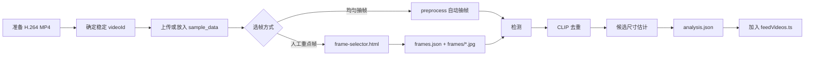

# Rombot 家装 Feed 前后端技术总结与扩展指南

> 文档状态：基于 2026-07-25 当前仓库代码整理。  
> 面向对象：继续开发 Feed、空间页、视频入库、家具识别、生图、生 3D、部署与前端 UI 的同学。  
> 目标：说明当前真实可运行链路、稳定契约和扩展边界，让新功能沿既有结构接入，而不是重新搭一条旁路。

---

## 1. 先看结论

当前系统已经形成两条职责不同的链路：

1. **在线交互热路径**：用户刷视频 → 暂停 → 前端计算 dHash → 后端匹配预分析帧 → 返回家具 Tags → 点击家具进入 `/space`。
2. **离线/重任务冷路径**：视频入库 → 选帧或抽帧 → 家具检测 → CLIP 去重 → 尺寸估计 → 选中家具 → 参考图生成 → Image-to-3D → GLB。

二者必须继续保持分离：

- Feed 只负责“发现、暂停识别、选择家具和导航”，不等待生图或 3D。
- `/space` 负责消费 `frameId + objectId`，继续选物、生成、摆放与编辑。
- 视频识别结果应尽量在入库时生成 `analysis.json`；用户暂停时只做本地缓存匹配。
- `POST /api/feed/select-object` 当前仍是同步长任务，后续正式产品化时应优先改成异步任务。
- FastAPI + Vite 同域部署是完整链路的标准形态；前端 Worker 适配器只适合预置数据演示，不等价于完整后端。

当前可直接打开的页面：

| 页面 | 路径 | 用途 |
|---|---|---|
| Feed | `/`、`/feed` | 竖屏视频、暂停识别、点击家具 |
| Space 占位页 | `/space` | 验证跳转参数，等待空间编辑器替换 |
| 接口看板 | `/dashboard` | 给 UI、前端和联调同学查看链路、状态与实时 OpenAPI |
| Swagger | `/docs` | 调试真实后端接口 |
| 原始 OpenAPI | `/openapi.json` | 代码生成或接口契约读取 |
| 人工筛帧 | `/static/frame-selector.html` | 为视频保存人工关键帧 |
| 旧链路联调 | `/static/pipeline-test.html` | 识别、选物、GLB 全链路调试 |
| 健康检查 | `/health` | 部署探活 |

---

## 2. 当前能力边界

### 2.1 已实现并验证

- React + TypeScript 竖屏视频 Feed。
- `scroll-snap` 上下切换和 `IntersectionObserver` 当前视频判定。
- 当前视频自动播放，非当前视频暂停，相邻视频预加载。
- 移动端 `100dvh`、安全区、`muted + playsInline + loop`。
- 暂停时计算 64-bit dHash，不上传完整暂停截图。
- 后端基于 `videoId + time + frameHash` 匹配前后预分析帧。
- 返回真实家具对象、置信度、bbox、Tag 位置和去重候选图。
- `object-fit: cover` 裁切场景下的 Tag 坐标换算。
- 播放、拖动、切页时取消旧请求并阻止迟到响应污染当前页面。
- 点击具体家具跳转 `/space`，携带完整选物身份。
- 视频 `2、3、4、6、7` 作为 H.264 演示数据，均有预分析结果。
- FastAPI 同域托管 Vite 构建产物、视频、分析和运行输出。
- `/dashboard` 从运行中的 `/openapi.json` 自动展示全部接口。
- Docker 多阶段构建，部署镜像不安装 Torch/Transformers。

### 2.2 已有但仍是过渡实现

- `/space` 只是参数展示占位页，未接真实空间编辑器。
- `/api/feed/select-object` 可走真实生图/生 3D，但同步等待任务完成。
- 分割默认可使用 bbox mock；接入 SAM3 后才是精细 mask。
- `/api/room/scan` 返回 mock 房间，不是真实户型扫描。
- Feed 列表目前来自静态 TypeScript 数据，不是推荐接口。
- 运行产物保存在本机文件系统，不是数据库或对象存储。

### 2.3 明确不应误认为已上线

- 登录、用户、收藏、评论、真实点赞和推荐系统。
- 视频实时逐帧识别。
- 空间编辑、家具摆放、碰撞与持久化。
- 真实房间重建。
- 生成任务队列、Webhook、跨实例任务状态。
- 多租户权限、计费、配额和生产级监控。

---

## 3. 总体架构

```mermaid
flowchart LR
    U[移动端用户] --> F[React Feed]
    F -->|播放| V[/sample_data/videos/*.mp4]
    F -->|暂停并计算 64-bit dHash| D[POST /api/feed/detect]
    D --> A[analysis.json]
    A --> M[前后候选帧 dHash 匹配]
    M --> T[DetectResponse + Tags]
    T -->|点击具体对象| S[/space 查询参数]
    S --> SO[POST /api/feed/select-object]
    SO --> C[去重 crop / bbox crop]
    C --> B[家具特征 Brief]
    B --> R[Seedream 参考图]
    R --> G[Hunyuan / Tripo / Meshy]
    G --> GLB[/outputs/.../model.glb]

    I[视频入库] --> P[POST /api/video/preprocess]
    P --> E[抽帧或复用人工帧]
    E --> O[家具检测]
    O --> DD[CLIP 去重与尺寸估计]
    DD --> A
```

### 3.1 技术栈

| 层 | 当前技术 |
|---|---|
| Web | React 19、TypeScript、Vite 7 |
| 图标 | lucide-react |
| 前端测试 | Vitest、Playwright |
| API | FastAPI、Pydantic v2、Uvicorn |
| HTTP 客户端 | httpx |
| 图像处理 | Pillow、浏览器 Canvas |
| 离线去重 | Torch、Torchvision、Transformers、CLIP |
| 数据与产物 | 本地 JSON + 图片 + GLB 文件 |
| 部署 | 多阶段 Docker，FastAPI 同域托管 SPA |

### 3.2 为什么同域

正式部署默认让页面、视频、API 和输出资源共享同一 HTTPS Origin：

```text
https://example.com/feed
https://example.com/api/feed/detect
https://example.com/sample_data/videos/2.mp4
https://example.com/outputs/videos/2/analysis.json
```

这样可同时解决：

- Canvas 读取视频画面时的跨域污染问题。
- dHash 截帧的 CORS 配置问题。
- 相对资源 URL 在前端和接口返回值中的一致性。
- SPA、API、视频和 GLB 的部署地址管理。

前后端分离仅用于本地开发或明确的独立部署。此时必须同时配置：

- 前端 `VITE_API_BASE_URL`。
- 后端 `CORS_ORIGINS`。
- 视频和图片服务允许 Canvas 跨域读取。

---

## 4. 仓库目录与职责

```text
lucky/
├─ frontend/
│  ├─ src/
│  │  ├─ App.tsx                    # 轻量路径分发
│  │  ├─ components/
│  │  │  ├─ VideoFeed.tsx           # Feed 容器、当前页判定
│  │  │  ├─ VideoFeedItem.tsx       # 播放、暂停识别、Tags、跳转
│  │  │  ├─ FeedActions.tsx         # 右侧展示操作
│  │  │  ├─ SpacePlaceholder.tsx    # Space 占位页
│  │  │  └─ ApiDashboard.tsx        # 动态接口看板
│  │  ├─ data/feedVideos.ts         # 五条演示视频配置
│  │  ├─ lib/
│  │  │  ├─ api.ts                  # API 地址和暂停检测调用
│  │  │  ├─ dhash.ts                # 前端 9×8 dHash
│  │  │  ├─ geometry.ts             # cover 模式 Tag 坐标换算
│  │  │  └─ navigation.ts           # Feed → Space 协议
│  │  ├─ types.ts                   # 前端公共类型
│  │  └─ styles.css                 # Feed、Space、看板样式
│  ├─ e2e/                          # Playwright 移动端测试
│  ├─ public/covers/                # Feed 封面
│  ├─ worker/                       # 轻量预置演示适配器
│  └─ vite.config.ts                # 本地开发代理
├─ backend/
│  ├─ app/
│  │  ├─ main.py                    # FastAPI、路由、静态目录、SPA fallback
│  │  ├─ config.py                  # 环境变量和 Provider 配置
│  │  ├─ schemas.py                 # 后端公共数据契约
│  │  ├─ routers/
│  │  │  ├─ feed.py                 # detect / select-object / run-pipeline
│  │  │  ├─ video.py                # 上传、人工帧、预处理、分析读取
│  │  │  ├─ room.py                 # 房间 mock
│  │  │  ├─ debug.py                # 单图链路调试
│  │  │  └─ health.py               # 健康检查
│  │  ├─ services/
│  │  │  ├─ detection/              # 检测 Provider
│  │  │  ├─ segmentation/           # 分割 Provider
│  │  │  ├─ video_preprocess/       # 抽帧、识别、去重、匹配、尺寸
│  │  │  ├─ image_generation/       # Seedream 参考图
│  │  │  ├─ model3d/                # 3D Provider
│  │  │  └─ room_scan/              # mock 场景
│  │  └─ storage/local_store.py      # 本地路径与 URL 映射
│  ├─ sample_data/videos/            # 演示源视频
│  ├─ outputs/                       # 分析、裁剪、参考图、GLB
│  ├─ static/                        # 旧版联调工具
│  ├─ scripts/                       # 回填、生成与集成测试
│  ├─ requirements.txt               # 本地完整依赖
│  └─ requirements.runtime.txt       # 轻量在线运行依赖
├─ Dockerfile
├─ 暂停识别技术方案.md
├─ 空间能量优化工具_技术方案.md
└─ backend/交接说明.md
```

查找改动位置时，可先用下表：

| 想改什么 | 首选入口 |
|---|---|
| Feed 视频、标题、场景类型 | `frontend/src/data/feedVideos.ts` |
| 暂停、重试、Tags、跳转交互 | `frontend/src/components/VideoFeedItem.tsx` |
| 当前视频判定和预加载策略 | `frontend/src/components/VideoFeed.tsx` |
| 前端请求封装 | `frontend/src/lib/api.ts` |
| Space 跳转参数 | `frontend/src/lib/navigation.ts`、`frontend/src/types.ts` |
| Tag 对齐算法 | `frontend/src/lib/geometry.ts` |
| 新后端 Schema | `backend/app/schemas.py` |
| Feed 核心接口 | `backend/app/routers/feed.py` |
| 视频入库/预处理 | `backend/app/routers/video.py` |
| 模型或 Provider 开关 | `backend/app/config.py`、对应 `services/` |
| 文件落盘和 URL | `backend/app/storage/local_store.py` |
| SPA/static 挂载 | `backend/app/main.py` |
| 前端设计看板 | `frontend/src/components/ApiDashboard.tsx` |

---

## 5. Feed 在线链路

### 5.1 视频切换与生命周期

`VideoFeed.tsx` 使用容器级 `IntersectionObserver`：

- 可见比例达到 `0.65` 才切换当前索引。
- 当前索引对应视频调用 `play()`。
- 其他视频调用 `pause()` 并清理识别状态。
- 当前视频和相邻一条视频使用 `preload="auto"`。
- 更远的视频使用 `preload="metadata"`。

设计原则：同一时间只允许一条视频主动播放。

浏览器自动播放可能失败，因此当前视频默认 `muted`。如果 `play()` 被浏览器拒绝，页面保持暂停，不把失败当作业务错误。

### 5.2 暂停识别状态机

前端识别状态：

```text
idle
  └─ 用户暂停当前视频 → loading
       ├─ objects.length > 0 → success
       ├─ objects.length = 0 → empty
       ├─ 请求失败 → error
       └─ 播放/拖动/切页 → idle
```

只有同时满足以下条件才会发起识别：

- 当前 Feed item 是激活页。
- 视频未结束。
- `readyState >= 2`，当前帧已经可读。
- 事件来自当前仍暂停的视频。

程序化暂停非当前视频时，不应留下 Tags。当前实现通过 `isActive`、请求序号和 `AbortController` 三层保护。

### 5.3 dHash 协议

前端在 Canvas 中把当前视频画面缩放为 `9 × 8`：

1. RGBA 转灰度：`0.299R + 0.587G + 0.114B`。
2. 每行比较相邻 9 个像素，得到 8 个比较位。
3. 共 8 行，形成 64 bit。
4. 输出补零后的 16 位十六进制字符串。

请求示例：

```json
{
  "videoId": "2",
  "time": 12.4,
  "frameHash": "0f1e2d3c4b5a6978"
}
```

约束：

- `frameHash` 必须是 16 位十六进制。
- 前后端算法不可各自随意调整；任何算法修改都要同步更新测试和已有 `analysis.json` 中的 `perceptualHash`。
- 视频必须同源或提供正确 CORS，否则 `getImageData()` 会失败。

### 5.4 后端暂停帧匹配

`POST /api/feed/detect` 首先尝试读取：

```text
backend/outputs/videos/<videoId>/analysis.json
```

匹配逻辑：

1. 时间完全相同则直接返回该帧。
2. 否则只选择暂停时间之前和之后各一帧作为候选。
3. 有 `frameHash` 时计算 Hamming Distance，距离小者优先。
4. dHash 距离相同时，时间距离更近者优先。
5. 仍相同时选择前一帧。
6. hash 或帧文件异常时，回退到按时间最近匹配。

这意味着在线识别的复杂度固定且很低，不会随着视频总帧数线性增长。

如果没有 `analysis.json`，接口才会回退到实时 `DETECTION_PROVIDER`。Feed 演示数据不应依赖这个兜底，因为它会增加时延和外部模型不确定性。

### 5.5 防止旧响应污染

每次识别都会：

- 增加本地请求序号。
- abort 上一个请求。
- 记录发请求时的 `currentTime`。

响应回来后必须再次确认：

- 请求序号仍是最新。
- 视频仍暂停。
- item 仍激活。
- 当前时间与请求时间误差不超过 `0.08s`。

新增诸如“拖动进度条”“长按预览”“快速回看”功能时，应继续复用这一套失效策略。

### 5.6 Tag 坐标

后端返回：

- `bbox`：源视频像素坐标 `[x1, y1, x2, y2]`。
- `tagPosition`：相对于源画面的归一化坐标 `[x, y]`，范围通常为 `0~1`。

因为前端使用 `object-fit: cover`，原画面会等比放大并从两侧或上下裁切。坐标换算为：

```text
scale = max(containerWidth / sourceWidth, containerHeight / sourceHeight)
renderedWidth = sourceWidth * scale
renderedHeight = sourceHeight * scale
offsetX = (containerWidth - renderedWidth) / 2
offsetY = (containerHeight - renderedHeight) / 2

screenX = offsetX + tagX * renderedWidth
screenY = offsetY + tagY * renderedHeight
```

UI 同学可以改 Tag 的视觉尺寸和动效，但不要直接把 `tagPosition` 当屏幕百分比使用。

---

## 6. Feed → Space 稳定跳转协议

点击家具 Tag 后进入：

```text
/space?videoId=2&time=12.40&sceneType=living_room&frameId=2_000003&objectId=obj_sofa_001&objectLabel=sofa
```

### 6.1 参数定义

| 参数 | 必传 | 含义 |
|---|---:|---|
| `videoId` | 是 | 视频稳定 ID，与 `outputs/videos/<videoId>` 对应 |
| `time` | 是 | 用户暂停时间，秒，固定两位小数 |
| `sceneType` | 是 | Feed 场景分类 |
| `frameId` | 是 | 后端实际匹配到的预分析帧 ID |
| `objectId` | 是 | 用户点击的帧内对象 ID |
| `objectLabel` | 否 | 用于 UI 立即展示，不作为对象主键 |

### 6.2 主键原则

空间页的真实选物身份是：

```text
frameId + objectId
```

不要使用以下替代做法：

- 不要只传 `objectLabel=sofa`。
- 不要进入空间页后重新识别。
- 不要默认选择识别结果中的第一个对象。
- 不要用页面显示名称当数据库主键。

### 6.3 空间页接入建议

空间页第一阶段可以直接：

1. 解析并校验查询参数。
2. 用 `frameId + objectId` 调 `POST /api/feed/select-object`。
3. 展示任务中状态。
4. 成功后加载 `object.glbUrl`。
5. 使用 `estimatedDimensions` 作为初始尺寸，而不宣称它是真实测量值。

当前 `select-object` 同步时间可能达到数分钟。正式空间页不建议直接长期等待，应先完成第 14.6 节的异步任务改造。

---

## 7. 视频入库与预分析

### 7.1 推荐入库流程



### 7.2 新增一条 Feed 视频的标准步骤

1. 使用只包含字母、数字、下划线或连字符的稳定 `videoId`。
2. 确保视频是浏览器广泛支持的 H.264/AAC MP4；不要直接加入 HEVC 视频。
3. 把演示文件放入 `backend/sample_data/videos/<videoId>.mp4`，或调用上传接口。
4. 生成并放置 `frontend/public/covers/<videoId>.webp`。
5. 用人工筛帧页保存重点暂停点，或使用自动抽帧。
6. 调 `POST /api/video/preprocess` 生成 `analysis.json`。
7. 检查分析状态、帧数、对象数和去重候选数。
8. 人工打开 Feed，在重点暂停点确认 Tag 是否正确。
9. 最后才在 `frontend/src/data/feedVideos.ts` 中加入该视频。
10. 更新 Dockerfile 中需要复制进演示镜像的分析和视频文件；如果继续使用 Worker 演示适配器，也要更新其构建输入。

硬性规则：**没有对应 `analysis.json` 的视频，不进入正式 Feed 演示列表。**

### 7.3 人工帧模式

人工保存后的结构：

```text
outputs/videos/<videoId>/
├─ frames.json
└─ frames/
   ├─ frame_t000012345ms.jpg
   └─ frame_t000018000ms.jpg
```

预处理请求：

```json
{
  "videoId": "7",
  "mode": "ark_grounding",
  "reuseExistingFrames": true
}
```

保存或删除人工帧会使旧 `analysis.json`、`deduplicated/` 和 `objects/` 失效或被清理，这是正确行为：帧集合改变后必须重新分析。

### 7.4 分析输出

```text
outputs/videos/<videoId>/
├─ frames/                         # 人工或自动抽取的源帧
├─ frames.json                     # 帧时间清单
├─ analysis.json                   # Feed 在线匹配的核心缓存
├─ objects/                        # 逐帧对象 crop/mask
├─ deduplicated/
│  └─ candidate_sofa_001/
│     ├─ crop.jpg
│     └─ metadata.json
└─ generated/
   └─ <frameId>/
      └─ ...                       # 选物后的生成产物
```

`analysis.json` 包含：

- 视频状态与采样间隔。
- 每个分析帧的 `frameId`、时间、图片 URL、dHash 和对象列表。
- 跨帧去重后的家具候选。
- 每个帧内对象到去重候选的映射。
- 可选尺寸估计和去重警告。

### 7.5 去重和尺寸

CLIP 去重把多个帧中的同一件家具归为同一个 `deduplicatedObjectId`，并给出稳定 `deduplicatedCropUrl`。空间页生成时优先使用这个代表图，避免使用遮挡更严重的随机帧 crop。

`estimatedDimensions` 是品类与视觉先验得到的初始米制尺寸：

- 可用于 3D 初始缩放。
- `isMeasured=false` 时不能展示为真实测量值。
- 修改尺寸算法后，应回填已有分析，避免同一品类出现两套规则。

---

## 8. 后端接口总览

运行时以 `/openapi.json` 为唯一机器可读事实，`/dashboard` 会动态读取它。当前业务路由共 15 个：

| 方法 | 路径 | 请求 | 响应 | 用途 |
|---|---|---|---|---|
| GET | `/health` | 无 | 状态 JSON | 健康检查 |
| POST | `/api/feed/detect` | `DetectRequest` | `DetectResponse` | 暂停帧匹配或实时识别 |
| POST | `/api/feed/select-object` | `SelectObjectRequest` | `SelectObjectResponse` | 选物、裁剪、参考图、3D |
| POST | `/api/feed/run-pipeline` | `FeedPipelineRequest` | `FeedPipelineResponse` | 单次跑 detect + select |
| POST | `/api/debug/image-pipeline` | `DebugImagePipelineRequest` | `FeedPipelineResponse` | 本地单图链路调试 |
| POST | `/api/room/scan` | `RoomScanRequest?` | `SceneResponse` | mock 房间场景 |
| GET | `/api/video/manual-frames/{video_id}` | Path | `ManualFramesResponse` | 读取人工帧清单 |
| POST | `/api/video/manual-frames` | `ManualFrameSaveRequest` | `ManualFramesResponse` | 保存一张人工暂停帧 |
| DELETE | `/api/video/manual-frames/{video_id}/{time_ms}` | Path | `ManualFramesResponse` | 删除指定人工帧 |
| DELETE | `/api/video/manual-frames/{video_id}` | Path | `ManualFramesResponse` | 清空人工帧 |
| POST | `/api/video/upload` | Query + 原始请求流 | `VideoUploadResponse` | 上传源视频 |
| POST | `/api/video/preprocess` | `VideoPreprocessRequest` | `VideoPreprocessResponse` | 视频离线预分析 |
| GET | `/api/video/analysis/{video_id}` | Path | `VideoAnalysis` | 读取完整分析 |
| GET | `/api/video/analysis/{video_id}/nearest` | Path + `time` | `VideoAnalysisFrame` | 读取时间最近帧 |
| GET | `/api/video/detect/{video_id}` | Path + `time` | `DetectResponse` | 从分析直接构造检测响应 |

静态资源入口不计入上述 API 数量：

| 路径 | 本地目录 |
|---|---|
| `/sample_data/*` | `backend/sample_data/*` |
| `/outputs/*` | `backend/outputs/*` |
| `/static/*` | `backend/static/*` |
| `/assets/*` | `frontend/dist/assets/*` |

`backend/app/main.py` 最后注册 SPA history fallback，因此 `/feed`、`/space`、`/dashboard` 刷新时会返回 `frontend/dist/index.html`，而不是 404。新增 API 或静态挂载必须继续放在 catch-all 路由之前。

---

## 9. 核心数据契约

### 9.1 前端 FeedVideo

```ts
type SceneType = "living_room" | "bedroom" | "study" | "dining_room"

interface FeedVideo {
  id: string
  title: string
  author: string
  videoUrl: string
  coverUrl: string
  sceneType: SceneType
  furnitureHints: string[]
}
```

如果新增场景类型，需要同步修改：

- `frontend/src/types.ts`
- Feed 配置和显示文案
- 空间页对 `sceneType` 的解析
- 后端未来若建立枚举，也要同步更新
- 相关单测和 E2E

### 9.2 DetectRequest

```json
{
  "videoId": "2",
  "time": 12.4,
  "frameImage": null,
  "frameHash": "0f1e2d3c4b5a6978"
}
```

| 字段 | 说明 |
|---|---|
| `videoId` | 必填，定位预分析目录 |
| `time` | 必填，秒，非负 |
| `frameHash` | Feed 首选，16 位 hex |
| `frameImage` | 无缓存实时识别或调试时使用的 Data URL |

正常 Feed 不同时上传 `frameImage`，避免网络和序列化开销。

### 9.3 DetectedObject

```json
{
  "id": "obj_sofa_001",
  "label": "sofa",
  "name": "沙发",
  "confidence": 0.94,
  "bbox": [118, 420, 690, 850],
  "tagPosition": [0.43, 0.61],
  "cropUrl": "/outputs/videos/2/objects/...",
  "maskUrl": null,
  "deduplicatedObjectId": "candidate_sofa_001",
  "deduplicatedCropUrl": "/outputs/videos/2/deduplicated/candidate_sofa_001/crop.jpg",
  "estimatedDimensions": {
    "widthM": 1.9,
    "depthM": 0.95,
    "heightM": 0.85,
    "unit": "m",
    "isMeasured": false
  },
  "visualFeatures": {},
  "generationHints": {}
}
```

字段语义：

- `id`：帧内稳定对象 ID。
- `label`：机器友好的英文品类。
- `name`：面向用户的显示名称。
- `bbox`：源帧像素坐标。
- `tagPosition`：源帧归一化坐标。
- `cropUrl/maskUrl`：当前帧对象产物。
- `deduplicatedObjectId/deduplicatedCropUrl`：跨帧去重后的代表对象。
- `visualFeatures/generationHints`：后续生成可复用的语义，避免二次视觉调用。

注意：前端当前 `DetectedObject` 类型只声明了 Feed 必需字段。空间页若要消费尺寸、视觉特征或生成提示，应扩展前端类型，不能用无类型的任意字段长期透传。

### 9.4 DetectResponse

```json
{
  "frameId": "2_000003",
  "frameImageUrl": "/outputs/videos/2/frames/frame_t000012400ms.jpg",
  "objects": []
}
```

`frameId` 是后续选物的关键身份。它不一定等于用户暂停时间对应的字符串，因为后端返回的是实际匹配到的预分析帧。

### 9.5 SelectObject

请求：

```json
{
  "frameId": "2_000003",
  "objectId": "obj_sofa_001",
  "frameImage": null,
  "imageUrl": null,
  "cropImage": null
}
```

生成输入优先级：

```text
imageUrl → cropImage → 分割 crop → 检测 crop
```

响应包含：

- `taskId` 和状态。
- 选中对象及 `glbUrl`。
- 面向用户的对象分析和摆放建议。
- 生成 brief、参考图、Provider 和过程备注。

当前虽然有 `taskId`，接口仍会同步等待完成；不要据此误判为已有后台任务系统。

---

## 10. Provider 架构

Provider 选择集中在：

- `backend/app/config.py`：读取环境变量。
- `backend/app/routers/feed.py`：工厂选择和参数校验。
- `backend/app/services/*`：实际实现。

### 10.1 检测

| `DETECTION_PROVIDER` | 说明 |
|---|---|
| `mock` | 无外部依赖的测试实现 |
| `ark_grounding` | 当前真实演示常用 |
| `grounded_sam2` | 外部 Grounded SAM2 服务 |

视频预处理还支持：

- `ark_grounding`
- `grounded_sam2`
- `doubao_grounding_sam`
- `mock`
- 人工帧复用

### 10.2 分割

| `SEGMENTATION_PROVIDER` | 说明 |
|---|---|
| `mock` | bbox crop，稳定、快 |
| `sam3` | 精细分割；需要 Endpoint |

### 10.3 3D

| `MODEL3D_PROVIDER` | 说明 |
|---|---|
| `feature_tripo` | Ark brief + Seedream 参考图 + Tripo |
| `feature_hunyuan` | Ark brief + Seedream 参考图 + Hunyuan |
| `feature_meshy` | OpenAI 视觉/图片 + Meshy |
| `hunyuan3d` | 直连 Hunyuan |
| `meshy` | 直连 Meshy |
| `pixal3d` | 外部 Pixal3D |
| `mock` | 测试实现 |

更细的模型参数、提示词、供应商限制和已知坑以 `backend/交接说明.md` 与 `backend/识图生图生3D协议与Prompt.md` 为准。

### 10.4 新增 Provider 的标准方式

1. 在对应 `services/<capability>/` 下新增实现，不把供应商代码写进路由。
2. 与现有 base/provider 方法签名保持一致。
3. 在 `config.py` 中增加必要环境变量。
4. 在 `feed.py` 或 `video.py` 的工厂中注册。
5. 对缺失密钥给出明确的 500 配置错误。
6. 增加 mock 或协议测试，禁止必须付费才能跑基础测试。
7. 更新 `.env.example`、接口看板说明和专项交接文档。
8. 不改变公开响应 Schema，除非确实需要前端同步升级。

---

## 11. 前端扩展规则

### 11.1 新增页面

当前 `App.tsx` 用 `window.location.pathname` 做极简路径分发，适合黑客松演示。新增一两个静态入口可沿用该方式。

当出现以下任一需求时，应迁移到正式路由库：

- 嵌套路由。
- 登录拦截。
- 页面级数据加载和错误边界。
- Space 内部有多个步骤或子页面。
- 浏览器返回栈、动态参数和路由状态明显增多。

迁移时必须保留 FastAPI history fallback。

### 11.2 新增 API 调用

所有前端请求统一经过 `frontend/src/lib/api.ts` 中的 `apiUrl()`：

```ts
const configuredBaseUrl = import.meta.env.VITE_API_BASE_URL?.trim() ?? ""
```

规则：

- 正式同域部署保持空字符串。
- 不要在组件里硬编码 `http://127.0.0.1:8000`。
- 为每个业务请求声明输入和输出类型。
- 长请求支持取消、超时或任务化。
- 错误优先读取 FastAPI `{ detail }`，再回退 HTTP 状态。

当 API 数量继续增加时，建议拆为：

```text
frontend/src/api/
├─ client.ts
├─ feed.ts
├─ video.ts
├─ space.ts
└─ generated-types.ts
```

可基于 `/openapi.json` 自动生成类型，但生成文件不要手工修改。

### 11.3 UI 重构的稳定边界

前端 UI 同学可以自由修改：

- 颜色、字体、图标和布局。
- 暂停扫描动效。
- Tag 视觉与避让。
- 右侧互动按钮。
- Feed 标题和作者信息。
- 空状态、错误态和 loading 表现。

不应无意改变：

- 当前页的唯一播放原则。
- 暂停触发条件。
- dHash 算法和格式。
- `AbortController` 与请求序号保护。
- `object-fit: cover` 坐标换算。
- `frameId + objectId` 跳转协议。
- 无对象或失败时不得伪造识别结果。

### 11.4 看板如何保持最新

`/dashboard` 的完整接口区直接读取 `/openapi.json`，因此后端新增标准 FastAPI 路由和 Schema 后，会自动出现在看板。

仍需人工维护的部分：

- 产品链路文案。
- 三个核心接口示例。
- Feed → Space 参数示例。
- UI 状态说明。
- 演示视频配置。

后端新增接口后，至少检查一次：

1. OpenAPI 是否带有正确 tag、summary、请求和响应模型。
2. `/dashboard` 能否展示。
3. `/docs` 是否能直接试调。

---

## 12. 后端扩展规则

### 12.1 新增 API

标准步骤：

1. 在 `backend/app/schemas.py` 增加 Pydantic 请求/响应模型。
2. 在职责对应的 `routers/*.py` 增加路由。
3. 业务逻辑放在 `services/`，不要堆在路由函数中。
4. 文件操作统一经过 `storage/` 或新的 Repository 层。
5. 为路由声明 `response_model`。
6. 明确 400、404、409、422、500 等错误语义。
7. 在 `main.py` 注册新 router，且必须位于 SPA catch-all 之前。
8. 加测试并检查 `/openapi.json` 与 `/dashboard`。

### 12.2 给现有响应新增字段

建议只做向后兼容的可选字段：

1. 先更新 Pydantic Schema。
2. 更新所有 Provider 的构造逻辑。
3. 更新已有 `analysis.json` 的回填脚本。
4. 更新前端 TypeScript 类型。
5. 增加旧分析文件缺少字段时的兼容测试。
6. 前端上线后，再考虑把字段改成必填。

不要只改某一个 Provider，否则切换 Provider 时响应会漂移。

### 12.3 文件路径与 URL

后端返回的本地资源使用站点根相对 URL：

```text
/outputs/...
/sample_data/...
```

`local_store.py` 负责：

- `Path → /outputs URL`
- `/outputs URL → Path`
- Data URL 保存
- 帧 ID 到输出目录映射

视频预分析帧 ID 形如：

```text
<videoId>_<6位序号>
```

它会映射到：

```text
outputs/videos/<videoId>/generated/<frameId>/
```

不符合该格式的旧实时帧会放在：

```text
outputs/<frameId>/
```

扩展代码不要自行拼接多套路径，应复用 `local_store.py`。

### 12.4 从本地文件迁移到对象存储

推荐引入 Storage 抽象，而不是直接把现有所有 `Path` 改成云 URL：

```text
Storage
├─ LocalStorage
└─ ObjectStorage
```

至少定义：

- `save_bytes(key, data)`
- `read_bytes(key)`
- `exists(key)`
- `public_url(key)` 或签名 URL
- `delete(key)`

`analysis.json` 中应存稳定对象 key 或可长期访问 URL，避免把短期签名 URL永久写入分析。

---

## 13. 本地开发

### 13.1 一体化方式

先构建前端，再由 FastAPI 托管：

```powershell
cd frontend
npm ci
npm run build

cd ..\backend
python -m uvicorn app.main:app --reload --host 127.0.0.1 --port 8000
```

打开：

```text
http://127.0.0.1:8000/feed
http://127.0.0.1:8000/space
http://127.0.0.1:8000/dashboard
http://127.0.0.1:8000/docs
```

### 13.2 前端 HMR

终端一：

```powershell
cd backend
python -m uvicorn app.main:app --reload --host 127.0.0.1 --port 8000
```

终端二：

```powershell
cd frontend
npm run dev
```

Vite 会把以下路径代理到 `127.0.0.1:8000`：

- `/api`
- `/outputs`
- `/sample_data`
- `/static`

前端地址通常为 `http://127.0.0.1:5173`。

### 13.3 环境依赖

在线轻量运行：

```text
backend/requirements.runtime.txt
```

本地视频预处理、CLIP 去重：

```text
backend/requirements.txt
```

不要把 Torch、Torchvision、Transformers 无条件加入公网轻量镜像；它们只在需要离线预处理的进程中安装。

---

## 14. 常见功能如何丝滑接入

### 14.1 增加第六条 Feed 视频

改动最少的路径：

1. 准备 H.264 MP4。
2. 生成封面。
3. 人工选帧。
4. 跑 `preprocess`。
5. 验证 `analysis.json`。
6. 加入 `feedVideos.ts`。
7. 更新镜像复制清单。
8. 跑 Feed E2E。

不要先把视频加到 Feed 再补分析，这会让演示阶段出现随机慢识别或失败。

### 14.2 增加真实 Space 编辑器

建议拆成以下层：

```text
SpacePage
├─ SpaceEntryLoader       # 读取并校验 query
├─ AssetGenerationPanel  # 提交/查看生成任务
├─ SceneCanvas            # Three.js / R3F
├─ AssetLibrary           # 已生成家具
└─ ScenePersistence       # 保存场景
```

第一版只需把占位页替换为：

```text
query → frameId/objectId → 提交生成 → GLB → 放入场景
```

Feed 无需修改，只要继续遵守现有 URL 协议。

### 14.3 给家具 Tag 增加预览卡

可直接使用 `DetectedObject` 中已有：

- `name`
- `confidence`
- `deduplicatedCropUrl`
- `estimatedDimensions`
- `visualFeatures`

推荐交互：

- 单击 Tag 先打开底部卡片。
- 卡片中的主按钮再进入 Space。
- Tag 本身仍绑定稳定 `objectId`。
- 图片失败时展示品类占位，不伪造产品图。

如果产品仍要求“一次点击直接进入 Space”，则保留当前行为。

### 14.4 增加推荐 Feed 后端

保持 `FeedVideo` 作为前端稳定 ViewModel，新接口只负责返回同结构或可映射结构：

```text
GET /api/feed/videos?cursor=...
```

需要补充：

- `nextCursor`
- 去重和分页语义
- 视频 URL 有效期
- 对应分析状态
- 只下发 `analysisStatus=ready` 的视频

前端切换数据源时，不改暂停识别和跳转协议。

### 14.5 增加实时未预分析视频

可以沿用 `DetectRequest.frameImage`，但这是独立的慢路径：

1. 前端截取暂停帧。
2. 压缩为合适尺寸 JPEG。
3. POST `frameImage`。
4. 后端实时检测并落盘。
5. 返回 `DetectResponse`。

需要显式处理：

- Canvas CORS。
- 请求体大小。
- 超时和取消。
- API 成本与限流。
- 重复暂停的缓存键。
- 隐私和上传提示。

正式 Feed 仍建议先预分析。

### 14.6 把生图/3D 改成异步任务

这是空间页正式化的最高优先级后端改造。建议新增而不是直接破坏旧接口：

```text
POST /api/generation/tasks
GET  /api/generation/tasks/{taskId}
POST /api/generation/tasks/{taskId}/cancel
```

任务状态：

```text
queued → analyzing → generating_reference → generating_3d
       → succeeded | failed | cancelled
```

响应至少包含：

- `taskId`
- `status`
- `progress`
- `stage`
- `errorCode/errorMessage`
- `result.glbUrl`
- `generation` 轨迹

后端应把 Provider 轮询移出 HTTP 请求生命周期，使用任务队列或独立 Worker。成功结果按输入 hash 缓存，避免同一候选重复付费生成。

### 14.7 增加真实房间扫描

不要直接替换 mock Schema 后让前端被迫重写。优先保持：

- `sceneId`
- `unit`
- `room`
- `objects`
- `suggestions`

真实扫描新增字段可先设为可选，例如：

- 墙体/门窗多边形。
- 坐标系定义。
- 扫描置信度。
- 原始 mesh URL。
- 锚点和楼层。

必须先写清楚坐标系、轴方向、单位和旋转顺序，再接 Three.js。

---

## 15. 测试与回归

### 15.1 前端单测

```powershell
cd frontend
npm test
```

当前重点覆盖：

- dHash 输出格式与位比较。
- `object-fit: cover` 坐标换算。
- Space 参数构造和时间格式。

修改这三类基础算法必须新增或更新测试。

### 15.2 前端 E2E

```powershell
cd frontend
npm run test:e2e
```

Playwright 使用移动端 Chrome 视口，并可自动启动 FastAPI。重点验证：

- `/feed` 可打开。
- 视频纵向滑动。
- 当前视频播放、非当前视频暂停。
- 暂停出现真实 Tags。
- 快速播放/暂停和切页不残留旧 Tags。
- 点击 Tag 进入 `/space`。
- 参数完整。
- `/space` 和 `/dashboard` 刷新不 404。

### 15.3 后端回归

在 `backend/` 下运行：

```powershell
python scripts/test_feed_web_integration.py
python scripts/test_pause_frame_matching.py
python scripts/test_select_object_deduplicated_crop.py
```

按改动范围补充：

- 识别 Provider：对应 parse/preflight 测试。
- 尺寸：`test_dimension_estimation.py`。
- 去重：`test_video_deduplication.py`。
- 视频预处理：`test_video_preprocess_flow.py`。
- 生图/3D：只在有密钥的受控环境跑付费集成测试。

### 15.4 新功能 Definition of Done

每个新增功能至少满足：

- 有明确输入、输出、错误和空状态。
- 公共字段有前后端类型。
- 旧分析数据仍可读取，或提供回填脚本。
- 页面刷新不 404。
- 移动端主路径可操作。
- API 失败不阻塞 Feed 基础播放。
- 不提交 `.env`、密钥、短期签名结果和不必要的大模型文件。
- `/dashboard` 和专项文档已更新。

---

## 16. 部署

### 16.1 标准 Docker 链路

根目录 `Dockerfile`：

1. Node 22 阶段安装依赖并构建 Vite。
2. 把演示视频和 `analysis.json` 纳入构建输入。
3. Python 3.11 阶段安装轻量运行依赖。
4. 复制后端和 `frontend/dist`。
5. Uvicorn 监听 `${PORT:-8000}`。
6. `/health` 作为容器健康检查。

构建与运行：

```powershell
docker build -t rombot-feed .
docker run --rm -p 8000:8000 --env-file backend/.env rombot-feed
```

### 16.2 生产环境要求

- 单域 HTTPS。
- 反向代理允许 MP4 Range Request。
- `/outputs` 使用持久卷或对象存储。
- 视频、图片、GLB 设置合理缓存头。
- `analysis.json` 更新时有版本或缓存失效策略。
- 密钥只通过平台 Secret 注入。
- CORS 仅允许真实前端 Origin。
- 对上传、预处理和生成接口加鉴权与限流。
- 对外不要暴露任意本地 `imagePath` 调试能力。
- 日志不能记录 Data URL、密钥或完整供应商签名 URL。

### 16.3 Worker/静态演示适配器

`frontend/worker/` 和构建脚本可把固定视频分析嵌入轻量演示环境，提供缓存式 `/api/feed/detect`。

它适合：

- 黑客松纯展示。
- 没有 Python 运行环境的静态站点。
- 固定五条视频的暂停匹配。

它不适合：

- 视频上传和预处理。
- 实时模型调用。
- 选物生成、生图、生 3D。
- 持久化输出。
- 作为完整生产后端。

完整链路仍以 Docker + FastAPI 为准。

---

## 17. 性能、成本与稳定性

### 17.1 热路径性能预算

Feed 暂停命中预分析时，服务端只应做：

- 读已缓存分析。
- 取前后两帧。
- 比较两个 64-bit hash。
- 序列化 `DetectResponse`。

目标是 200ms 量级返回。若明显变慢，优先检查：

- `analysis.json` 是否存在。
- `videoId` 是否一致。
- 是否意外进入实时 Provider。
- 文件系统或网络盘延迟。
- 响应对象是否过大。

### 17.2 生成路径

Brief、Seedream 和 3D Provider 是付费且高延迟步骤：

- 对 `deduplicatedObjectId` 做结果缓存。
- 同一候选只生成一次参考图和 GLB。
- 支持任务复用和失败续跑。
- 把供应商原始结果留在受控日志或 metadata，不直接暴露密钥。
- 对 Hunyuan、Tripo、Meshy 做质量、成本和超时路由。

### 17.3 数据规模

当前读取 `analysis.json` 和遍历视频目录适合演示。规模增长后应迁移：

- 视频元数据 → 数据库。
- 分析与文件 → 对象存储。
- `frameId/objectId` 查找 → 索引表。
- 生成任务 → 任务队列和任务表。
- 推荐流 → 分页 API 与缓存。

特别注意：当前 `find_object()` 会扫描 `outputs/videos/*/analysis.json`。视频数量上升后必须建立直接索引，不能继续全目录遍历。

---

## 18. 已知风险与排查顺序

### 18.1 暂停后没有 Tags

按顺序检查：

1. 是否当前激活视频。
2. 视频是否已加载到 `readyState >= 2`。
3. 浏览器控制台是否出现 Canvas CORS 错误。
4. `/api/feed/detect` 请求体的 `videoId/time/frameHash`。
5. `outputs/videos/<videoId>/analysis.json` 是否存在。
6. 匹配帧的 `objects` 是否为空。
7. 是否刚播放、拖动或切页导致请求被正确取消。

### 18.2 Tag 位置漂移

检查：

- `videoWidth/videoHeight` 是否已读取。
- 容器 ResizeObserver 是否更新。
- CSS 是否仍是 `object-fit: cover`。
- 是否绕过 `coverTagPosition()`。
- 后端 `tagPosition` 是否是源画面归一化坐标。
- 视频是否发生旋转元数据导致宽高理解不一致。

### 18.3 视频无法播放

优先检查编码，而不是只检查 `.mp4` 后缀：

- 推荐 H.264 视频 + AAC 音频。
- 避免 HEVC 作为 Web 演示唯一格式。
- 服务端应支持 Range Request。
- iOS 需要 `playsInline`。
- 自动播放必须默认 muted。

### 18.4 Space 找不到对象

检查：

- URL 是否同时有 `frameId` 和 `objectId`。
- `frameId` 是否来自 detect 响应，而不是前端自行拼接。
- 对应 analysis 是否仍存在。
- 人工帧变化后是否重新跑了 preprocess。
- 是否错误地把 `deduplicatedObjectId` 当作帧内 `objectId`。

### 18.5 Docker 能看 Feed 但不能预处理

这是当前镜像设计预期：

- Runtime 镜像不包含 Torch/Transformers。
- 公网服务主要读取预生成分析。
- 预处理应在完整开发环境或独立重任务 Worker 中运行。

### 18.6 生成接口长时间无响应

当前 `select-object` 同步轮询供应商。检查：

- Provider 密钥和额度。
- 供应商任务状态。
- poll interval 和 attempts。
- 是否已有可复用结果。
- 是否应改用异步任务接口。

供应商具体限制见 `backend/交接说明.md`。

---

## 19. 推荐演进路线

### P0：把 Space 变成真实闭环

- 替换 `/space` 占位页。
- 校验跳转参数。
- 加异步生成任务 API。
- GLB 加载、基础摆放和错误恢复。
- 生成结果缓存。

### P1：工程稳定化

- 从 `App.tsx` 轻量分发迁移正式前端路由。
- 按领域拆 API Client。
- 从 OpenAPI 生成 TypeScript 类型。
- 为 `analysis.json` 增加 schema/version。
- 对视频元数据和对象建立索引。
- 对上传/预处理/生成接口增加权限。

### P2：内容与体验

- Feed 分页与推荐接口。
- Tag 避让、聚合和预览卡。
- 视频多清晰度、首屏优化、封面/CDN。
- Space 家具库、收藏和复用。
- 实时进度、取消和失败续跑。

### P3：空间能力

- 真实 room scan。
- 坐标系、墙体、门窗和尺度协议。
- 自动摆放与布局建议。
- 场景保存、分享和多人协作。

---

## 20. 修改前后的检查清单

### 修改前

- 明确功能属于 Feed 热路径、视频冷路径还是 Space 生成路径。
- 确认公开主键是 `videoId`、`frameId/objectId` 还是生成 `taskId`。
- 查看 `/dashboard` 和 `/docs` 的当前契约。
- 检查工作树，避免覆盖已有分析和用户改动。
- 涉及外部模型时确认是否会产生费用。

### 修改后

- 更新 Pydantic 和 TypeScript 类型。
- 验证旧 `analysis.json` 兼容性。
- 跑对应单测、后端脚本和移动端 E2E。
- 验证 `/feed`、`/space`、`/dashboard` 刷新。
- 验证播放/拖动/切页会取消识别。
- 验证 Tag 点击只触发导航，不触发视频继续播放。
- 验证正式构建使用相对 API URL。
- 更新本文件和专项文档中受影响的部分。

---

## 21. 文档分工与事实来源

后续维护时按以下优先级判断事实：

1. **运行中的 `/openapi.json`**：接口机器契约。
2. **`backend/app/schemas.py` 与路由源码**：后端真实行为。
3. **`frontend/src/types.ts` 与调用代码**：前端实际消费范围。
4. **本文件**：跨前后端结构、扩展规范和排查手册。
5. **`backend/交接说明.md`**：识别、生图、生 3D Provider 与提示词脉络。
6. **`暂停识别技术方案.md`**：暂停匹配方案设计背景。
7. **`backend/识图生图生3D协议与Prompt.md`**：生成协议与 Prompt。
8. **`空间能量优化工具_技术方案.md`**：空间能力规划。

文档与代码冲突时，以代码和 OpenAPI 为准，并在同一改动中修正文档。

---

## 22. 给下一位开发者的最短上手路径

1. 安装前后端依赖。
2. 构建 `frontend/dist`。
3. 启动 FastAPI。
4. 打开 `/dashboard` 确认健康、接口和五条视频分析均可读。
5. 打开 `/feed`，滑动视频并暂停。
6. 点击任一真实家具 Tag，检查 `/space` 参数。
7. 查看对应 `outputs/videos/<videoId>/analysis.json`。
8. 需要改模型时再阅读 `backend/交接说明.md`。
9. 新功能优先复用 `FeedVideo`、`DetectResponse` 和 `frameId + objectId`，不要新建重复身份体系。

做到以上九步，就已经掌握了当前系统最重要的前后端边界。
