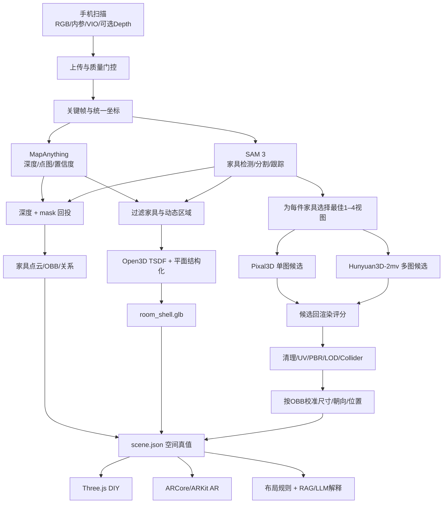

# 基于视觉识别与知识推理的空间能量优化工具：技术实现方案

> 文档版本：v0.2（实施版）  
> 更新日期：2026-07-19  
> 目标读者：产品负责人、移动端工程师、3D/算法工程师、后端工程师、前端工程师  
> 核心约束：不依赖外接相机或扫描仪；普通手机 RGB 相机必须可用；允许使用手机自带 IMU/VIO；LiDAR/ToF 只作为可选增强。  
> 首版范围：单个房间、静态环境、Android 单一测试机型、6–10 类常见大件家具。

## 0. 文档目标与最终技术结论

本项目的正确实现方式不是让一个模型“一键生成整间房”，而是建立一个统一世界坐标，把三类结果组合起来：

1. **空间骨架**：墙、地板、顶、门窗、米制尺度和全局坐标，由手机 VIO、MapAnything 和 TSDF 负责。
2. **家具实例**：每件家具的 ID、类别、位置、朝向、长宽高和空间关系，由 SAM 3、多视图深度回投和 OBB 拟合负责。
3. **精细家具资产**：家具的细致几何与 PBR 外观，由 Pixal3D、Hunyuan3D-2mv 等资产生成模型负责。

最终方案可以概括为：

> **全屋扫描负责空间真值；SAM 3 负责识别和跟踪家具；Pixal3D/Hunyuan3D-2mv 负责精细家具资产；`scene.json` 负责把结构、资产和关系重新组合。**

精细家具模型不能自行决定真实尺寸和世界位置。它必须缩放、旋转并放置到扫描得到的家具包围盒中。对于抖音中准备购买的新家具，尺寸应优先来自商品规格，位置由用户或布局算法决定。

## 1. 产品目标、边界与非目标

### 1.1 五项核心能力

| 功能 | 首版目标 | 依赖的核心数据 |
|---|---|---|
| 全屋扫描建模 | 单房间结构、家具实例、精细资产、GLB/JSON | 米制坐标、房间结构、家具 OBB |
| 暂停视频识别和比价 | 选中家具、提取前后帧、生成/检索相似家具、展示价格 | 视频帧、家具 mask、商品库 |
| 布局与寓意分析 | 可解释的动线、碰撞、采光及文化规则建议 | `scene.json`、规则库、用户偏好 |
| 家具 AR 摆放 | 按真实尺寸在现场放置家具并做遮挡/碰撞提示 | GLB、真实尺寸、AR anchor |
| 个人小屋 DIY | 2D/3D 移动、旋转、替换、撤销、保存方案 | 可编辑场景图和独立家具资产 |

### 1.2 首版不承诺的能力

- 不承诺普通 RGB 手机一次扫描即可得到厘米级、无误差的全屋模型。
- 不承诺单张图片可以忠实恢复家具不可见的背面、底部和内部结构。
- 不把 Gaussian Splatting 或“看起来逼真”当成尺寸正确的证据。
- 不把生成模型猜测的家具尺寸用于购买适配或安全判断。
- 不在首版同时支持 iOS、Android、全屋多层和所有家具类别。
- 不将“风水/气运”包装为科学、医疗、投资或安全结论。

## 2. 系统的三层真值

必须从数据结构上区分三种模型，不能混成一个 GLB：

| 层 | 内容 | 是否作为空间真值 | 是否可替换 |
|---|---|---:|---:|
| 结构层 | 墙、地板、顶、门窗、房间 polygon | 是 | 通常否 |
| 实例层 | 家具 ID、类别、OBB、transform、关系 | 是 | 是 |
| 视觉资产层 | 精细 mesh、UV、PBR 贴图、LOD | 否，视觉用途 | 是 |

`scene.json` 是唯一的场景真值；GLB 是渲染资产。任何布局规则、碰撞判断和距离计算都应读取 `scene.json`，不能从渲染后的整体 GLB 反向猜测。

## 3. 端到端技术脉络



### 3.1 两条家具来源分支

系统必须区分“用户已有家具”和“抖音候选家具”。

#### 已有家具

- 图片来源：用户自己的全屋扫描关键帧。
- 位置和朝向：来自全屋扫描。
- 尺寸：来自深度点云和 OBB，低置信时用户校正。
- 精细资产：Pixal3D/Hunyuan 只负责改善外观和几何细节。

#### 抖音候选家具

- 图片来源：暂停点前后的视频帧。
- 位置：初始没有世界位置；由用户放置、替换现有家具或由布局算法推荐。
- 尺寸：优先读取商品 SKU 规格；其次用户输入；最后才是图像估计，并必须标记不确定。
- 精细资产：由视频中的 1–4 个有效视图生成，或直接使用商家提供的官方 3D 模型。

## 4. 技术选型与职责边界

### 4.1 主技术栈

| 模块 | 首选 | 职责 | 不负责 |
|---|---|---|---|
| 手机采集 | Android Kotlin + ARCore | RGB、内参、VIO pose、可选 Depth、扫描引导 | 精细网格生成 |
| 度量几何 | `facebook/map-anything-apache` | 多视图深度、点图、相机、置信度、尺度融合 | 家具类别和精细纹理 |
| 表面融合 | Open3D TSDF | RGB-D 融合、点云和三角网格 | 识别家具类别 |
| 结构化 | RANSAC + 重力对齐 + Manhattan 约束 | 墙地顶、房间 polygon、门窗候选 | 照片级渲染 |
| 家具语义 | SAM 3 | 检测、实例 mask、视频跟踪 | 真实世界尺寸 |
| 单图精细资产 | Pixal3D | 单个完整家具的高保真几何和 PBR GLB | 世界位置和可信尺度 |
| 多图精细资产 | Hunyuan3D-2mv | 利用 1–4 个真实视图增强结构可靠性 | 房间重建和世界坐标 |
| API/任务 | FastAPI + Redis + RQ/Celery | 上传、状态、任务编排、重试 | GPU 算法本身 |
| Web 编辑器 | React + React Three Fiber/Three.js | 加载场景、DIY、审核、布局展示 | 扫描跟踪 |
| AR | ARCore，后续 ARKit | 平面放置、anchor、遮挡、光照 | 生成家具模型 |
| 数据 | PostgreSQL + S3 兼容存储 | 元数据、场景版本、资产文件 | 实时 3D 渲染 |

### 4.2 降级与替代

- 无 ARCore Depth：仍上传 RGB、内参和 VIO 位姿，由 MapAnything 预测深度。
- VIO 质量差：MapAnything/Depth Anything 3 估计位姿，必要时用 COLMAP bundle adjustment 精修。
- 没有任何米制信息：要求用户输入一个墙长或放置已知尺寸参照，否则输出相对尺度模型。
- 精细家具生成失败：保留可编辑 OBB、类别化低模或商品库代理资产。
- Pixal3D 显存不足：使用低显存模式或先用 TripoSG/SPAR3D 生成预览。
- 多视图之间发生剪辑或不是同一家具：禁止送入 Hunyuan3D-2mv，退回最佳单帧。

## 5. 数据契约先行

在写算法前先固定坐标、文件和 Schema，否则各模块会因坐标系和单位不一致反复返工。

### 5.1 坐标约定

- 所有长度单位统一为米。
- 场景世界坐标建议：右手系，`+Y` 向上。
- 模型推理输入按其要求转换，例如 MapAnything 使用 OpenCV camera-to-world：`+X` 右、`+Y` 下、`+Z` 前。
- 原始 ARCore pose 永久保存；转换后 pose 另存，禁止覆盖原始数据。
- 每个 GLB 的家具局部原点统一放在“底部中心”；局部正面方向统一为 `+Z`。
- 所有矩阵明确标注 `camera_to_world` 或 `world_to_camera`，不使用含糊的 `pose` 字段。

### 5.2 扫描输入包

```text
scan-001/
├── manifest.json
├── frames/
│   ├── 000001.jpg
│   └── 000002.jpg
├── depth/                     # 可选
│   ├── 000001.png
│   └── 000001_conf.png
└── telemetry/
    └── frames.jsonl
```

单帧记录：

```json
{
  "frame_id": 42,
  "timestamp_ns": 1234567890,
  "rgb_path": "frames/000042.jpg",
  "image_size": [1920, 1080],
  "intrinsics": [[1100.0, 0.0, 960.0], [0.0, 1100.0, 540.0], [0.0, 0.0, 1.0]],
  "camera_to_world_arcore": [[1, 0, 0, 0], [0, 1, 0, 0], [0, 0, 1, 0], [0, 0, 0, 1]],
  "tracking_state": "TRACKING",
  "depth_path": "depth/000042.png",
  "depth_unit": "millimeter",
  "depth_confidence_path": "depth/000042_conf.png",
  "blur_score": 132.4,
  "exposure_ok": true
}
```

### 5.3 场景输出

```text
scan-001/output/
├── room_shell.glb
├── room_raw_debug.glb
├── floorplan.svg
├── scene.json
├── quality_report.json
├── furniture/
│   ├── existing_sofa_01/
│   │   ├── asset.glb
│   │   ├── collider.glb
│   │   └── provenance.json
│   └── existing_table_01/
└── previews/
```

### 5.4 `scene.json` 核心结构

```json
{
  "schema_version": "1.0.0",
  "scene_id": "scan-001",
  "unit": "meter",
  "coordinate_system": "RH_Y_UP",
  "room": {
    "id": "room_01",
    "shell_asset": "room_shell.glb",
    "floor_polygon_xz": [[0, 0], [5.2, 0], [5.2, 3.8], [0, 3.8]],
    "ceiling_height_m": 2.75
  },
  "objects": [
    {
      "id": "existing_sofa_01",
      "category": "sofa",
      "source_type": "existing_scan",
      "transform": {
        "position_m": [2.14, 0.0, -1.35],
        "rotation_xyzw": [0.0, 0.7071, 0.0, 0.7071],
        "scale": [1.0, 1.0, 1.0]
      },
      "size_m": [2.10, 0.85, 0.78],
      "collision_type": "obb",
      "visual_asset": "furniture/existing_sofa_01/asset.glb",
      "visual_is_generated": true,
      "evidence_frame_ids": [18, 24, 31, 42],
      "confidence": {
        "category": 0.94,
        "position": 0.89,
        "size": 0.76,
        "asset_fidelity": 0.72
      },
      "relations": [
        {"type": "supported_by", "target": "floor_01"},
        {"type": "against_wall", "target": "wall_03", "distance_m": 0.06}
      ]
    }
  ]
}
```

## 6. 推荐仓库结构

```text
lucky/
├── apps/
│   ├── android-scanner/        # ARCore 扫描与 AR 预览
│   └── web-editor/             # Three.js 审核与 DIY
├── services/
│   ├── api/                    # FastAPI
│   └── worker/                 # GPU/CPU 任务执行器
├── pipelines/
│   ├── preprocessing/          # 校验、抽帧、坐标转换
│   ├── room_geometry/          # MapAnything、TSDF、结构化
│   ├── scene_understanding/    # SAM 3、回投、OBB、关系
│   ├── asset_generation/       # Pixal3D、Hunyuan、候选评分
│   └── layout_reasoning/       # 碰撞、动线、规则
├── packages/
│   ├── schemas/                # JSON Schema/Pydantic/TypeScript 类型
│   └── geometry/               # 坐标、矩阵、OBB 公共代码
├── tests/
│   ├── fixtures/               # 固定扫描样本
│   ├── geometry/
│   ├── assets/
│   └── e2e/
├── infra/
│   ├── docker/
│   └── compose.yaml
└── docs/
```

第一周先建立上述目录、Schema 和固定样本，不要一开始就写完整 App UI。

## 7. 阶段 0：准备真值和固定测试样本

### 7.1 目标

建立一个可重复运行的基准房间，使之后每次换模型或阈值都能比较，而不是凭截图判断。

### 7.2 操作步骤

1. 锁定一台 Android 测试手机，确认 ARCore 和 Depth API 支持情况。
2. 选择一个约 10–25 ㎡的卧室或客厅，保持环境静态。
3. 用卷尺/激光尺记录墙长、层高、门窗位置。
4. 选择 5 件大件家具，记录类别、中心位置、长宽高和 yaw。
5. 录制两次独立扫描，便于测试重复性。
6. 将一份扫描冻结为 `tests/fixtures/room_001`，之后不再修改。

### 7.3 阶段输出

- `ground_truth.json`
- 原始扫描包
- 房间手绘平面图和测量照片
- 首版验收表

### 7.4 完成标准

- 同一家具和墙体拥有明确的真值 ID。
- 所有尺寸以米记录。
- 任意开发者可以在不进入现场的情况下复现实验。

## 8. 阶段 1：实现 Android 扫描采集

### 8.1 输入与输出

- 输入：ARCore 相机会话。
- 输出：第 5.2 节定义的扫描包。

### 8.2 采集内容

每个候选帧同步记录：

- CPU RGB 图像，不只保存屏幕录制视频。
- 相机内参。
- ARCore camera-to-world 位姿。
- tracking state。
- 可用时保存 Raw Depth 和 confidence。
- 时间戳、曝光、陀螺仪角速度等质量元数据。

### 8.3 关键帧策略

先使用可解释的启发式：

- tracking 必须为正常状态。
- 与上一关键帧平移超过约 0.15 m，或旋转超过约 10°。
- 图像不能明显模糊、过暗或过曝。
- 与上一帧间隔不低于约 0.3 s，避免重复帧。
- 单房间目标保留 40–120 帧；阈值需通过测试集调优。

### 8.4 扫描引导

1. 从门口开始，沿房间边缘缓慢走一圈并回到起点。
2. 先胸口高度水平扫描，再略向下补家具侧面和地面。
3. 保持约 0.5–5 m 距离，不使用数字变焦。
4. 实时提示“移动过快、画面模糊、跟踪丢失、区域未覆盖”。
5. 要求人和宠物离开，扫描期间不移动家具。
6. 镜子、玻璃、电视画面标记为高风险区域。

### 8.5 完成标准

- RGB、内参、pose、depth 能按时间戳一一对应。
- 扫描一圈后相机轨迹基本闭合。
- 数据包可离线重复处理，不依赖再次扫描。
- 坐标转换单元测试通过：已知点能在 ARCore、OpenCV 和世界坐标之间往返。

### 8.6 失败处理

- tracking 丢失：暂停收帧并提示回到上一稳定位置。
- 没有 Depth：标记 `depth_mode=predicted`，流程继续。
- 闭环误差大：提示用户补扫门口或高纹理区域。

## 9. 阶段 2：上传、任务编排和可观测性

### 9.1 最小 API

| 方法 | 路径 | 作用 |
|---|---|---|
| `POST` | `/v1/scans` | 创建扫描任务，返回分片上传地址 |
| `PUT` | `/v1/scans/{id}/parts/{part}` | 上传 manifest、帧或深度分片 |
| `POST` | `/v1/scans/{id}/complete` | 完成上传并启动验证 |
| `GET` | `/v1/jobs/{id}` | 获取阶段、进度、错误码和预计剩余时间 |
| `GET` | `/v1/scans/{id}/scene` | 获取场景 JSON 和资产地址 |
| `PATCH` | `/v1/scenes/{id}/objects/{object_id}` | 用户修正类别、尺寸和 transform |
| `POST` | `/v1/scenes/{id}/rebuild-derived` | 重算关系、碰撞和建议 |
| `POST` | `/v1/assets/generate` | 创建家具精细资产任务 |

### 9.2 状态机

```text
UPLOADING
→ VALIDATING
→ PREPROCESSING
→ RECONSTRUCTING
→ SEGMENTING
→ FUSING
→ ASSET_GENERATING
→ NEEDS_REVIEW / READY
→ FAILED
```

几何场景达到 `NEEDS_REVIEW` 后即可让用户查看，不必等待所有精细家具生成完成。家具资产应异步逐个替换 OBB，占位模型不会阻塞主流程。

### 9.3 日志和复现

每个任务记录：

- Git commit、Docker image digest。
- 模型名称、checkpoint、许可证快照。
- 所有阈值和随机 seed。
- GPU 类型、峰值显存、各阶段时长。
- 输入/输出文件哈希。
- 结构化错误码，禁止只返回“生成失败”。

## 10. 阶段 3：房间度量几何重建

### 10.1 预处理

1. 校验 manifest、时间戳、矩阵合法性和图片哈希。
2. 处理 EXIF 方向；缩放图像时同步缩放相机内参。
3. 根据模糊、曝光、VIO 状态和视角重叠选择关键帧。
4. 用 VIO 重力把世界坐标对齐到 `+Y` 向上。
5. 生成人、宠物、屏幕、镜面等排除 mask。

### 10.2 MapAnything 推理

向 `facebook/map-anything-apache` 输入：

```text
RGB + intrinsics + camera poses + optional metric depth
```

主要读取：

- `depth_z`
- `pts3d`
- `camera_poses`
- `conf`
- `mask`
- `metric_scaling_factor`

24GB 显存建议从 16–32 帧重叠窗口开始，每个窗口保留 4–8 个重叠关键帧；这是工程起点，不是固定参数。窗口之间使用共享相机和 3D 点进行 SE(3)/Sim(3) 对齐。

### 10.3 位姿与尺度校验

- 优先采用手机 VIO 提供的米制轨迹作为尺度锚。
- 将模型预测轨迹与 VIO 对齐并计算残差。
- 有 Raw Depth 时，用高置信深度对预测深度做尺度和偏置校正。
- 闭环漂移超阈值时，运行位姿图优化或 COLMAP bundle adjustment。
- 没有任何米制来源时，强制进入“等待尺度校准”状态。

### 10.4 两次表面融合

需要生成两个不同用途的网格：

1. `room_raw_debug.glb`：保留静态场景全部表面，用于调试几何质量。
2. `room_shell.glb`：融合时排除家具、人物和动态 mask，只保留建筑结构。

这样后续放入精细家具时不会出现粗家具和精细家具叠模。

### 10.5 TSDF 与结构化

1. 使用 Open3D TSDF 融合 RGB、深度、内参和外参。
2. 过滤低置信深度和离群点。
3. 根据重力方向识别地面和顶面。
4. 使用 RANSAC 查找墙面。
5. 将墙法向聚成主要水平轴，但允许斜墙例外。
6. 平面相交得到墙角和 2D floor polygon。
7. 家具遮挡后的墙/地面以结构平面补全，明确标记 `inferred_surface=true`。
8. 门窗由几何空洞与语义检测联合生成，低置信时让用户确认。

### 10.6 阶段输出与验收

输出：

- `room_raw_debug.glb`
- `room_shell.glb`
- `floorplan.svg`
- 墙、地、顶、门窗 JSON
- 几何质量报告

验收目标：

- 主要墙面和地面均被识别。
- 房间主尺寸误差目标不超过 `max(10 cm, 真值的 5%)`。
- 地板基本水平，墙面不发生明显弯曲。
- 建筑结构网格中不存在完整的双层家具。

## 11. 阶段 4：家具实例和空间关系

### 11.1 SAM 3 检测与跟踪

首版类别控制在：

```text
bed, sofa, table, chair, cabinet, wardrobe, television, desk, lamp, plant
```

流程：

1. 对间隔较大的关键帧运行文本提示检测。
2. 对检测结果生成实例 mask。
3. 在扫描视频中向前、向后跟踪实例。
4. 同类多实例使用外观 embedding、空间投影和轨迹连续性保持 ID。
5. 人、宠物等动态实例只用于排除，不写入永久家具列表。

### 11.2 2D mask 回投到 3D

对每个实例和每个有效帧：

```text
mask像素 + depth + intrinsics
→ 相机坐标3D点
→ camera_to_world
→ 世界坐标3D点
```

随后：

- 按 track ID 聚合多帧点云。
- 删除墙面、地面点和统计离群点。
- 拟合 OBB，得到中心、轴向和长宽高。
- 使用类别先验校验，例如床/沙发通常由地面支撑，柜体通常竖直。
- 类别先验只能降置信或建议修正，不能覆盖强观测证据。

### 11.3 空间关系

首版计算：

- `supported_by`
- `against_wall`
- `near`
- `left_of` / `right_of`
- `in_front_of`
- `blocks_path`
- `faces`
- `distance_to_door`

所有关系必须保存数值证据，例如距离、夹角和计算版本，便于解释和重算。

### 11.4 用户审核

审核页至少支持：

- 删除误检家具。
- 合并/拆分实例。
- 修改类别。
- 拖动中心和旋转 yaw。
- 输入真实长宽高。
- 标记“暂不生成精细模型”。

### 11.5 验收目标

- 预设大件家具实例召回率目标 ≥ 80%。
- 家具中心误差目标 ≤ 20 cm。
- 朝向误差目标 ≤ 10°。
- 尺寸相对误差目标 ≤ 15%。
- 所有低置信对象都能在 30 秒内人工修正。

## 12. 阶段 5：生成单件精细家具资产

### 12.1 为每件家具准备输入

从 `evidence_frame_ids` 中选图，评分维度包括：

- 家具 mask 面积。
- 清晰度和曝光。
- 遮挡比例。
- 是否看到完整底部和侧面。
- 与其他候选帧的视角差异。
- 纹理可见度。

生成两类输入：

- `best_single.png`：最佳单帧透明背景图，交给 Pixal3D。
- `multiview/`：2–4 个真实不同视角，交给 Hunyuan3D-2mv。

禁止把同一镜头的近乎重复帧冒充多视图。若视频发生剪辑、家具移动或 track ID 不一致，应退回单图路线。

### 12.2 Pixal3D 路线

适用条件：家具在一张图中相对完整、轮廓清晰、遮挡较少。

输出：高分辨率 GLB、几何、UV 和 PBR 材质候选。

Pixal3D 不提供可信世界尺度，因此必须保留原 OBB，并在下一阶段校准。

### 12.3 Hunyuan3D-2mv 路线

适用条件：拥有 2–4 个真实不同视角，尤其是椅子、桌腿、沙发扶手、柜体侧面等结构容易出错的家具。

输出：多视图约束的 shape 候选；可再使用纹理模块生成贴图。

### 12.4 多候选生成与自动选择

每件家具可生成 2–4 个候选，而不是只接受第一次结果。对候选模型从原始相机视角重新渲染，并计算：

- 轮廓 IoU。
- 可见区域深度误差。
- 边缘距离。
- DINO/CLIP 类感知相似度。
- 多视图纹理一致性。
- 组件数量、非流形、自交和孔洞。
- 三角形数量和文件大小。

最终分数不能评估不可见面的“真实性”，因此背面仍标记为生成推断。

### 12.5 资产清理

选中候选后：

1. 删除漂浮小组件和退化面。
2. 统一法线方向。
3. 必要时重拓扑或减面。
4. 检查 UV 和 PBR 通道。
5. 生成 LOD0/LOD1/LOD2。
6. 生成简单 collider，碰撞仍优先使用 OBB。
7. 将局部原点移动到家具底部中心。
8. 统一正面方向为局部 `+Z`。
9. 输出 provenance，记录输入帧、模型、seed、许可证和生成时间。

### 12.6 渐进式体验

- 场景先显示 OBB 或类别低模。
- 大件家具优先生成：床、沙发、桌、柜。
- 精细资产完成一个就替换一个。
- 小件和低置信家具延后或保持代理模型。

## 13. 阶段 6：将精细家具放回房间

### 13.1 对齐步骤

1. 计算生成资产的局部包围盒和主轴。
2. 根据输入图的已知观察方向判断家具正面。
3. 将资产局部原点移动到底部中心。
4. 将资产尺寸拟合到扫描 OBB 或商品真实尺寸。
5. 使用实例的世界旋转确定朝向。
6. 使用实例世界位置放置资产。
7. 检查地面支撑、穿墙和碰撞。

概念公式：

```text
T_world_asset
= T_world_object
× R_front_correction
× S_metric_fit
× T_pivot_correction
```

### 13.2 尺度规则

- 已有家具：使用扫描 OBB；用户输入尺寸优先于估计值。
- 商品候选：使用 SKU 长宽高；没有规格时必须显示“尺寸待确认”。
- 非均匀缩放超过约 15% 时可能明显扭曲模型，应重新生成、换候选或让用户确认。
- 资产视觉几何可以超出 OBB 少量软垫/装饰，但 collider 和布局计算仍使用可信尺寸。

### 13.3 防止叠模

- 最终渲染使用 `room_shell.glb`，其中不包含家具。
- `room_raw_debug.glb` 只用于几何排错，不进入最终场景。
- 每件家具独立加载和隐藏，不能把所有资产永久烘焙为一个不可编辑网格。

### 13.4 完成标准

- 家具底部贴合地面或正确支撑面。
- 家具位置和朝向与 OBB 一致。
- 不出现明显粗家具/精细家具重叠。
- 替换家具后能立即重新计算碰撞和通道。
- 删除精细资产后仍能回退到 OBB，不丢失空间真值。

## 14. 阶段 7：场景审核与 DIY 编辑器

### 14.1 首版界面

- 左侧：2D 户型图。
- 中间：3D 场景。
- 右侧：选中对象的类别、尺寸、位置、朝向、置信度和资产来源。
- 底部：扫描原始证据帧和资产生成候选。

### 14.2 必须支持的操作

- 选择、移动、旋转、替换、删除家具。
- 墙面/地面吸附。
- 撤销和重做。
- 保存为新方案，不覆盖原始扫描场景。
- 显示碰撞、通道过窄和越界。
- 在“原始布局”和“方案布局”间切换。

### 14.3 场景版本

建议使用：

```text
base_scene       # 扫描结果，只能通过审核修正
proposal_001     # 用户DIY方案
proposal_002     # 自动布局方案
```

每次编辑保存 operation log，例如：

```json
{
  "op": "MOVE_OBJECT",
  "object_id": "candidate_sofa_02",
  "from": [2.1, 0.0, -1.3],
  "to": [1.4, 0.0, -0.8],
  "timestamp": "2026-07-19T12:00:00Z"
}
```

## 15. 阶段 8：暂停视频识别、搜索和比价

### 15.1 用户体验

用户只进行一次暂停或框选，但后台读取暂停点前后约 1–2 秒画面：

```text
暂停/框选
→ SAM 3 跟踪目标家具
→ 抽取12–30帧
→ 过滤模糊、剪辑和重复帧
→ 选最佳单帧及2–4个视角
→ 视觉搜索 + 3D资产生成
→ 相似款/同款候选 + 价格
→ 放入用户房间预览
```

### 15.2 商品检索

- OCR 读取品牌、型号和画面文字。
- SigLIP/CLIP 类 embedding 做图文联合召回。
- 类别、材质、颜色、尺寸和价格作为结构化过滤条件。
- 交叉编码器或多模态模型重排。
- “同款”和“相似款”分开展示，并提供置信度和差异点。

### 15.3 数据来源

- 优先商家开放平台、联盟 API、自有商品库和品牌合作数据。
- 不把网页爬虫作为核心依赖。
- 遵守抖音视频授权、著作权、水印和平台条款。

## 16. 阶段 9：AR 摆放

### 16.1 输入要求

- 带真实米制尺寸的 GLB/USDZ。
- 家具底部中心原点和统一正面方向。
- 简化 collider。
- 商品尺寸来源和可信度。

### 16.2 AR 流程

1. ARCore 建立现场世界坐标和地面平面。
2. 用户点击放置或从已有场景定位。
3. raycast 确定落点，anchor 保存姿态。
4. 使用环境深度做遮挡。
5. 使用光照估计调整资产显示。
6. 结合房间 `scene.json` 检查墙体和现有家具碰撞。

如果现场布局已经变化，提示用户快速重扫或手动重新定位，不能假设旧扫描永远有效。

## 17. 阶段 10：布局分析和知识推理

### 17.1 确定性几何层

由代码计算：

- 家具碰撞和越界。
- 通道宽度。
- 门的开启/通行区域。
- 家具与墙、窗、门的距离和朝向。
- 采光遮挡近似。
- 家具密度和可用面积。

### 17.2 规则层

每条规则保存：

- 规则 ID 和版本。
- 适用房间/家具。
- 几何前提。
- 证据等级。
- 文化语境。
- 建议、例外和替代方案。

### 17.3 LLM 层

LLM 只负责：

- 根据已计算事实选择和解释规则。
- 结合用户偏好生成自然语言建议。
- 比较多个布局方案的取舍。

LLM 不直接计算坐标、尺寸、碰撞或通道，也不能把低置信生成内容陈述为事实。

## 18. 从单房间扩展到全屋

全屋应使用“房间子地图 + 门洞约束 + 全局位姿图”，而不是把整套房作为一个无限长视频：

1. 每个房间独立生成 submap、结构、家具和质量分。
2. 经过门口时保留 3–5 秒两侧同时可见的过渡帧。
3. 门洞中心、尺寸、墙法向和过渡相机组成 submap 之间的边。
4. 连续 VIO 提供初始变换；会话中断时使用门洞和重叠图像重新定位。
5. 全局 pose graph 优化房间节点和门洞边。
6. 用户在 2D 户型图确认“哪个门连接哪个房间”。
7. 多楼层建立独立 floor graph，再通过楼梯端点连接。

输出 `house.json`：

```json
{
  "house_id": "house_001",
  "floors": [
    {
      "floor_id": "floor_01",
      "rooms": ["living_01", "bedroom_01"],
      "room_adjacency": [
        {"from": "living_01", "to": "bedroom_01", "portal": "door_03"}
      ]
    }
  ]
}
```

## 19. 开发里程碑：一步步完成

不要并行铺开五个产品功能，应按依赖顺序推进。

### M0：数据契约和真值（0.5–1 天）

- [ ] 建立仓库目录。
- [ ] 定义扫描 manifest、`scene.json`、quality report 的 JSON Schema。
- [ ] 建立坐标转换单元测试。
- [ ] 完成一个测试房间真值测量。

交付：固定样本、Schema、真值文件。没有这些不进入 M1。

### M1：采集包（1–2 天）

- [ ] Android ARCore 会话。
- [ ] 导出 RGB、内参、VIO pose。
- [ ] 可选导出 Raw Depth/confidence。
- [ ] 实现关键帧和基本扫描提示。
- [ ] 上传或本地导出扫描包。

交付：可重复处理的 `scan-001/input`。

### M2：米制粗房间（1–2 天）

- [ ] 跑通 MapAnything Apache。
- [ ] 接入真实内参和 pose，而非只跑图片 demo。
- [ ] 输出深度、点云和 raw GLB。
- [ ] 对齐 VIO 尺度，生成质量报告。

交付：尺寸基本正确的 `room_raw_debug.glb`。

### M3：干净房间结构（1–2 天）

- [ ] Open3D TSDF。
- [ ] 地面、墙、顶平面提取。
- [ ] 房间 polygon。
- [ ] 排除动态区域；家具 mask 可先人工提供。
- [ ] 输出无家具的 `room_shell.glb`。

交付：可以放置独立家具的结构模型。

### M4：家具实例（2–3 天）

- [ ] SAM 3 预设类别。
- [ ] 视频实例跟踪。
- [ ] mask 深度回投。
- [ ] 点云聚合和 OBB。
- [ ] 简单审核页。

交付：家具 ID、位置、朝向和尺寸写入 `scene.json`。

### M5：首个精细家具替换（1–2 天）

- [ ] 只选择一件无遮挡较少的沙发或桌子。
- [ ] 提取透明背景最佳单图。
- [ ] Pixal3D 生成 GLB。
- [ ] 完成原点、正面、尺寸和世界 transform 校准。
- [ ] 验证无叠模、无穿墙、贴地。

交付：第一个“粗 OBB → 精细资产”闭环。完成后再批量化。

### M6：多视图和资产评分（2–3 天）

- [ ] 选择 2–4 个真实视角。
- [ ] Hunyuan3D-2mv 候选。
- [ ] 候选回渲染。
- [ ] 轮廓、深度和感知相似度评分。
- [ ] 资产清理与 LOD。

交付：每件大件家具可自动选择较优候选。

### M7：Web DIY 和场景版本（2–3 天）

- [ ] Three.js 加载房间和独立家具。
- [ ] 2D/3D 联动。
- [ ] 移动、旋转、替换、撤销。
- [ ] 碰撞和越界提示。
- [ ] 保存 proposal scene。

### M8：抖音家具闭环（2–3 天）

- [ ] 暂停点前后抽帧。
- [ ] SAM 3 跟踪目标家具。
- [ ] 生成候选资产。
- [ ] 商品搜索与尺寸读取。
- [ ] 替换现有家具或放入空位。

### M9：AR 和布局建议（2–3 天）

- [ ] ARCore 放置和遮挡。
- [ ] 商品真实尺寸校验。
- [ ] 3–5 条确定性布局规则。
- [ ] LLM 解释规则，不计算几何。

## 20. 黑客松 48 小时压缩版

如果只有 48 小时，执行以下最短路径：

### 0–6 小时

- 锁定一台 Android 手机和一个房间。
- 导出 20–40 个 RGB + intrinsics + pose 关键帧。
- 记录墙长和 3 件家具真值。

### 6–16 小时

- 跑通 MapAnything Apache。
- 输出 raw 点云/GLB。
- Open3D TSDF 生成粗结构。

### 16–28 小时

- SAM 3 只识别沙发、床、桌、柜。
- mask 回投并拟合 OBB。
- 手动确认一次错误结果。

### 28–38 小时

- 只精细化一件核心家具。
- Pixal3D 单图生成资产。
- 按 OBB 放回房间。

### 38–46 小时

- Three.js 加载结构和家具。
- 支持移动、旋转、替换和碰撞提示。

### 46–48 小时

- 固定一份预生成结果作为演示保护。
- 展示扫描原图、OBB、精细家具替换和布局建议全过程。

黑客松不做：全屋多房间、全类别家具、Gaussian、完整比价平台、复杂知识图谱。

## 21. 测试和验收体系

### 21.1 房间几何

- 墙长/层高绝对误差和相对误差。
- 相机闭环漂移。
- 平面残差。
- 房间 polygon IoU。
- 结构网格完整率。

### 21.2 家具实例

- 实例 precision、recall 和类别 F1。
- ID switch 次数。
- 中心位置误差。
- 长宽高 MAPE。
- yaw 误差。
- 支撑/靠墙关系准确率。

### 21.3 精细资产

- 从证据视角回渲染的 silhouette IoU。
- 可见区域深度误差。
- PBR/UV 完整性。
- 非流形、自交、漂浮组件数量。
- LOD 三角形数和移动端帧率。
- 人工评分：正面忠实度、侧面合理性、背面不确定性。

### 21.4 体验指标

- 用户一次扫描完成率。
- 平均补扫次数。
- 扫描、上传、粗模型、精细资产各阶段耗时。
- 用户人工修正次数和耗时。
- 每个房间 GPU 秒、失败率和重试率。

## 22. 明确的失败与降级策略

| 问题 | 系统行为 |
|---|---|
| 覆盖不足 | 返回缺失区域和补扫提示 |
| 无米制尺度 | 要求输入已知长度，未完成前禁止可信 AR 尺寸 |
| 镜面/玻璃 | 从 TSDF 排除，标记不可测区域 |
| 家具低置信 | 半透明 OBB + 问号，不自动进入强结论 |
| 单图遮挡严重 | 请求补视角或生成多个候选，标记背面为推断 |
| 多视图不是同一家具 | 拒绝融合，退回最佳单图 |
| 精细资产失败 | 使用 OBB/低模，不影响空间分析 |
| 多房间拼接失败 | 保留独立房间，让用户确认门连接 |
| 商品没有尺寸 | 标记“不可验证是否放得下”，要求用户输入 |

## 23. 性能与成本

- 手机端只做采集、质量提示和 AR；大模型默认云端运行。
- 24GB GPU 环境顺序运行 MapAnything、SAM 3、Pixal3D，避免模型同时常驻。
- Hunyuan3D-2.1 完整形状和纹理约需更高显存；可以分阶段或使用云端更大 GPU。
- 粗模型应在数分钟级返回；精细家具作为异步任务逐个完成。
- 每次任务记录 GPU 秒，而不是只记录“一个房间多少钱”。

成本公式：

```text
单次扫描成本
= GPU秒 × GPU单价
+ CPU秒
+ 上传/下载流量
+ 对象存储
+ 冷启动和失败重试摊销
```

正式定价前必须使用自己的房间、帧数和家具数量基准测试，不能直接套用模型官方 demo 时间。

## 24. 数据、隐私和许可证

### 24.1 室内数据

- 室内扫描可能包含人脸、照片、地址、贵重物品和生活习惯，按高敏感数据处理。
- 端侧提示用户清场，可端侧模糊人脸、屏幕和照片。
- 原始帧、派生模型和分析结果分别设置保留期。
- 支持一键删除和导出。
- 默认不使用用户扫描数据训练模型；训练用途需要独立授权。

### 24.2 模型许可

| 组件 | 当前注意事项 |
|---|---|
| MapAnything | 代码 Apache 2.0；商用选择 `facebook/map-anything-apache` 权重 |
| SAM 3 | Meta SAM 自定义许可，接入前保存并审查当时许可证 |
| Pixal3D | 项目 MIT；第三方依赖分别核对 |
| Hunyuan3D-2/2.1 | 腾讯自定义社区许可，包含地域和规模条件，不能按普通开源许可理解 |
| Open3D | 使用时核对当前项目和依赖许可 |
| COLMAP | 主项目 New BSD，第三方依赖单独核对 |
| ARCore/ARKit | 遵守平台 SDK、隐私和商店政策 |

每次发布锁定模型 commit、checkpoint 和 model card，代码许可、权重许可、训练数据条款分别登记。

## 25. 关键技术决策记录

| 决策 | 选择 | 原因 |
|---|---|---|
| 首版平台 | Android + ARCore | 同一端复用 VIO、Depth 和 AR；减少跨平台变量 |
| 空间主模型 | MapAnything Apache | 可显式接收图片、内参、位姿和深度 |
| 表面模型 | TSDF + 参数化结构 | 可量测、可碰撞、可导出 |
| 家具空间真值 | SAM 3 mask + 多视图回投 + OBB | 世界位置来自观测而非生成猜测 |
| 单图精细化 | Pixal3D | 面向高保真几何和 PBR GLB |
| 多图精细化 | Hunyuan3D-2mv | 利用视频邻近视角增强结构可靠性 |
| 最终场景 | room shell + 独立家具 + `scene.json` | 可编辑、可替换、可追溯 |
| 推理原则 | 代码算几何，规则做判断，LLM 做解释 | 降低幻觉和不可复现结果 |
| 产品精度策略 | 置信度 + 补扫 + 用户校正 | 普通 RGB 无法保证不可见细节 |

## 26. 官方资料

实施时应锁定版本并再次检查官方仓库：

1. [MapAnything：多模态度量 3D 与 Apache 权重](https://github.com/facebookresearch/map-anything)
2. [Google ARCore Depth API](https://developers.google.com/ar/develop/depth)
3. [Google ARCore Recording and Playback](https://developers.google.com/ar/develop/recording-and-playback)
4. [Apple ARKit World Tracking](https://developer.apple.com/documentation/arkit/understanding-world-tracking)
5. [Open3D TSDF Volume](https://www.open3d.org/docs/latest/python_api/open3d.integration.TSDFVolume.html)
6. [Meta SAM 3](https://github.com/facebookresearch/sam3)
7. [Meta SAM 3D Objects](https://github.com/facebookresearch/sam-3d-objects)
8. [Pixal3D](https://github.com/TencentARC/Pixal3D)
9. [TRELLIS.2](https://github.com/microsoft/TRELLIS.2)
10. [Hunyuan3D-2 / Hunyuan3D-2mv](https://github.com/Tencent-Hunyuan/Hunyuan3D-2)
11. [Hunyuan3D-2.1 PBR](https://github.com/Tencent-Hunyuan/Hunyuan3D-2.1)
12. [PartCrafter](https://github.com/wgsxm/PartCrafter)
13. [Depth Anything 3](https://github.com/ByteDance-Seed/Depth-Anything-3)
14. [VGGT](https://github.com/facebookresearch/vggt)
15. [COLMAP](https://colmap.github.io/)

## 27. 现在立刻开始的七件事

按顺序执行：

1. 建立第 6 节仓库目录和 `scene.json` Schema。
2. 选定一台 Android 手机，确认 ARCore/Depth 支持情况。
3. 测量并扫描一个固定测试房间，生成 `ground_truth.json`。
4. 先打通 RGB + intrinsics + pose 的导出，不急着做漂亮 UI。
5. 用真实手机数据跑通 MapAnything 多模态推理和 Open3D TSDF。
6. 只选择一件沙发完成“SAM 3 mask → OBB → Pixal3D → 放回房间”的闭环。
7. 闭环通过后再扩展家具类别、多视图、抖音检索、AR 和知识推理。

第 6 步是整个项目最重要的技术里程碑：一旦它成功，后续功能都只是围绕同一个可编辑场景图增加输入、资产和规则。
